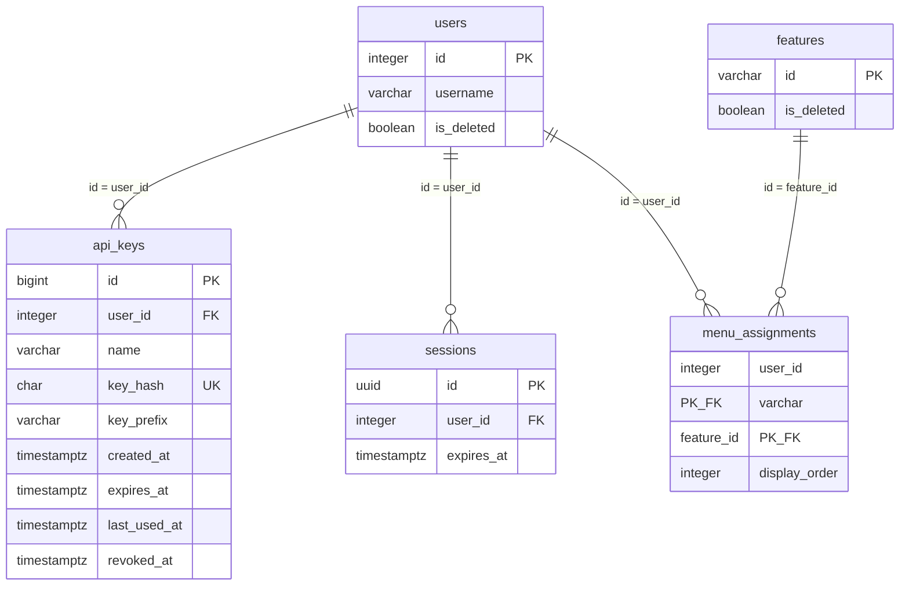

# api-key-management（APIキー管理）DB設計

> API のパスや画面の詳細は書かない（`api-design.md` / `ui-design.md`）。
> 機能固有テーブルはスキーマ `<feature_name>`（snake_case）に置く。`public` に業務テーブルを増やさない。

## 概要

本機能の固有スキーマ（`api_key_management`）は作らない。API キーの表は、対象機能（`goods-management`、`expense-management`、`knowhow-management`、`schedule`）も直接読むため、スキーマ `public` に置く（`rules/13-db.md` で `public` に置いてよい表）。

- 本機能が作成し、読み書きする表: `public.api_keys`
- 本機能・対象機能が読むだけの既存の表: `public.users`、`public.sessions`、`public.system_settings`、`public.features`、`public.menu_assignments`（列・制約は `portal` の DDL のとおり。本設計では変えない）
- `public.api_keys` の DDL は、本機能の `backend/sql/01_api_keys.sql` が持つ。`portal` の DDL（`public.users` などの作成）を先に適用しておく。

関連ドキュメント: `requirements.md` / `design.md` / `ui-design.md` / `api-design.md`

## ER図

`users`・`sessions`・`features`・`menu_assignments` は、本機能・対象機能が使う列だけを示す。

## テーブル設計

### `public.api_keys`

**目的**: ユーザが他システム連携のために発行した API キー。1 行が 1 つの API キー。キー全体は持たず、ハッシュと識別用の先頭部分だけを持つ。失効しても行は残す。

| カラム | 型 | NULL | 既定値 | 説明 |
|--------|----|----|--------|------|
| `id` | bigint | NOT NULL | IDENTITY | API キーの識別子。主キー。画面・API で失効の対象の指定に使う |
| `user_id` | integer | NOT NULL | | 持ち主。`public.users.id` への外部キー |
| `name` | varchar(100) | NOT NULL | | 名前（用途の表示名）。前後の空白を除いて保存する。空文字は置かない |
| `key_hash` | char(64) | NOT NULL | | キー全体の SHA-256 ハッシュ（16 進の小文字 64 文字）。一意 |
| `key_prefix` | varchar(12) | NOT NULL | | 識別用の先頭部分（キー全体の先頭 12 文字。接頭辞 `wak_` を含む） |
| `created_at` | timestamptz | NOT NULL | `now()` | 発行日時 |
| `expires_at` | timestamptz | NULL | | 有効期限。NULL は無期限 |
| `last_used_at` | timestamptz | NULL | | 最終利用日時。NULL は未使用 |
| `revoked_at` | timestamptz | NULL | | 失効日時。NULL は未失効 |

- 主キー: `id`
- 一意制約: `key_hash`（`api_keys_key_hash_key`）
- 外部キー: `user_id` → `public.users.id`（ON DELETE RESTRICT。ユーザは物理削除しない）
- 検査制約:
  - `api_keys_name_not_blank`: `btrim(name) <> ''`
  - `api_keys_expires_after_created`: `expires_at IS NULL OR expires_at > created_at`
  - `api_keys_revoked_after_created`: `revoked_at IS NULL OR revoked_at >= created_at`

**インデックス**

| 名前 | 対象カラム | 種別 |
|------|------------|------|
| `api_keys_pkey` | `id` | 主キー |
| `api_keys_key_hash_key` | `key_hash` | 一意（対象機能の認証での検索に使う） |
| `api_keys_user_created_idx` | `(user_id, created_at DESC)` | 通常（本人の一覧を発行日時の新しい順に取得する） |

**状態の判定**（列は持たず、読み出し時に判定する）

| 状態 | 条件 |
|------|------|
| 失効済み | `revoked_at IS NOT NULL` |
| 期限切れ | `revoked_at IS NULL AND expires_at IS NOT NULL AND expires_at <= 現在` |
| 有効 | 上記以外 |

API キーとして使えるのは、状態が「有効」で、かつ持ち主の `public.users.is_deleted = false` のときだけ。

**本機能の扱い**

- 発行: `user_id`（ログイン中ユーザ）、`name`、`key_hash`、`key_prefix`、`expires_at` を挿入する。`created_at` は既定値。`key_hash` の一意制約違反のときは、キーを生成し直して再挿入する。
- 一覧: `user_id` = ログイン中ユーザの行を、`created_at` の降順で全件（失効済みを含む）読む。`key_hash` は読まない・返さない。
- 失効: `id` と `user_id`（ログイン中ユーザ）が一致し、`revoked_at IS NULL` の行だけ `revoked_at = now()` に更新する。更新件数 0 は、対象なし（他人・存在しない）または失効済みとして失敗にする。どちらかはログのために読み分ける。
- 行の削除はしない。

**対象機能の扱い**

- 認証: 添えられたキーの SHA-256 ハッシュで `key_hash` を検索し、`public.users` を結合して、`revoked_at`、`expires_at`、`users.is_deleted` を判定する。その後、従来の割当判定（`public.features.is_deleted = false` かつ `public.menu_assignments` に `(user_id, 自機能の識別子)` の行がある）を行う。
- 最終利用日時: 許可したときだけ、当該行の `last_used_at = now()` に更新する。更新するのは `last_used_at` だけで、他の列は変えない。
- 挿入・失効・削除はしない。

### 既存の表（参照のみ）

列・制約は `portal` の DDL（`src/features/portal/backend/sql/`）のとおりで、本設計では変更しない。

| 表 | 本機能の扱い | 対象機能の扱い（変更点） |
|----|--------------|--------------------------|
| `public.users` | Cookie 認証でのユーザの特定、論理削除の判定 | API キーの持ち主の論理削除の判定を追加 |
| `public.sessions` | Cookie 認証（有効期限の延長を含む） | 変更なし（API キーによる要求では読まない・更新しない） |
| `public.system_settings` | ログイン画面 URL、メニュー画面 URL、共通アイコン（`icon_system`、`icon_back`）の読み取り | 変更なし |
| `public.features` | 本機能（`api-key-management`）の論理削除の判定 | 変更なし（従来の割当判定を API キーでも使う） |
| `public.menu_assignments` | 本機能の割当の判定 | 変更なし（従来の割当判定を API キーでも使う） |

## 関連

- `users` 1 対 多 `api_keys`。ユーザの論理削除では API キーの行を残す（持ち主が論理削除済みのキーは使えない）。
- `api_keys` は `features`・`menu_assignments` と結び付けない（キーごとの機能の限定はしない。利用できる機能は持ち主の割当で決まる）。

## 要件トレーサビリティ

| 要件 | 設計 |
|------|------|
| REQ-001 | `public.sessions`、`public.users`、`public.features`（`id = 'api-key-management'`）、`public.menu_assignments` |
| REQ-002 | `public.api_keys.user_id` による絞り込み |
| REQ-003 | `public.api_keys` への挿入。`key_hash`（一意）・`key_prefix` のみ保存、`expires_at`（NULL は無期限、検査制約） |
| REQ-004 | `public.api_keys` の読み取り（`created_at` 降順、状態の判定） |
| REQ-005 | `public.api_keys.revoked_at` の更新（行は残す） |
| REQ-006 | 対象機能による `public.api_keys`（`key_hash` 検索）・`public.users`・`public.features`・`public.menu_assignments` の参照 |
| REQ-007 | 対象機能による `public.api_keys.last_used_at` の更新 |
| REQ-008 | テーブルなし（ファイルログ） |

## 未決事項

- なし

## 承認

現在の状態: 承認済み

| 日時 | 状態 | 変更概要 |
|------|------|----------|
| 2026-09-26 00:40 | 未承認 | 初版 |
| 2026-09-26 00:40 | 承認済み | 初版を承認 |
