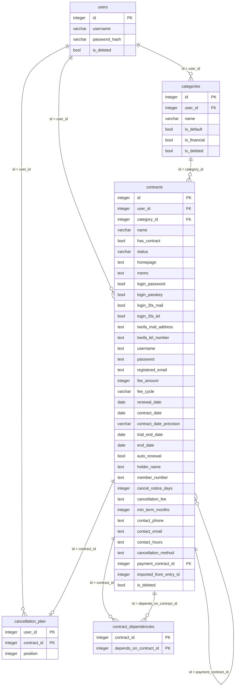

# contract-management DB設計

> API のパスや画面の詳細は書かない（`api-design.md` / `ui-design.md`）。

## 概要

- スキーマ: `contract_management`。区分、契約、契約の依存関係、解約順を置く。DDL は本機能の `backend/sql/01_contract_management.sql` が持つ（`portal` の DDL と `api-key-management` の DDL を、先に適用しておく）。
- ユーザ、セッション、機能マスタ、メニュー割当はスキーマ `public` を読む。複製しない。列は増やさない。表の作成は `portal` が担う。
- API キー（`public.api_keys`）は、API キーによる認証のために読み、許可したときに最終利用日時（`last_used_at`）だけを更新する。複製しない。列は増やさない。表の作成は `api-key-management` が担う（列と制約は `specs/api-key-management/db-design.md`）。
- 取り込み（REQ-010）のために、取り込みスクリプトだけが、`password_management.entries` を読む。通常の処理では読まない。
- ログはファイルへ出す。テーブルには置かない。

関連ドキュメント:

- 全体設計: `design.md`
- UI設計: `ui-design.md`
- API設計: `api-design.md`

## ER図

## テーブル設計

### contract_management.categories

**目的**: 利用者ごとの区分。「その他」（`is_default = true`）は、利用者が本機能を最初に使うときに作る。区分を削除しても行は残す（論理削除）。削除済みの契約が、削除した区分を参照し続けられるようにするため。

| カラム | 型 | NULL | 既定値 | 説明 |
|--------|-----|------|--------|------|
| `id` | integer | NOT NULL | IDENTITY | 主キー |
| `user_id` | integer | NOT NULL | | 所有者。`public.users.id` |
| `name` | varchar(100) | NOT NULL | | 区分の名称。空は置かない |
| `is_default` | boolean | NOT NULL | false | 「その他」のとき true。名称の変更・削除はできない |
| `is_financial` | boolean | NOT NULL | false | 金融機関の区分のとき true。この区分の契約だけが、支払方法に選べる |
| `is_deleted` | boolean | NOT NULL | false | 削除フラグ。true なら削除済み |

- 主キー: `id`
- 一意制約: `(user_id, name)` のうち `is_deleted = false` の行だけ（部分一意）。`(user_id)` のうち `is_default = true` の行だけ（部分一意。利用者ごとに「その他」は 1 つ）
- 外部キー: `user_id` → `public.users.id`（ON DELETE RESTRICT）
- 検査: `char_length(name) > 0`
- 検査: `NOT (is_default AND is_deleted)`（「その他」は削除済みにならない）
- 検査: `NOT (is_default AND is_financial)`（「その他」は金融機関にならない）

**インデックス**

| 名前 | 対象カラム | 種別 |
|------|------------|------|
| `ux_categories_user_name` | `(user_id, name)` のうち `is_deleted = false` | 部分一意 |
| `ux_categories_user_default` | `(user_id)` のうち `is_default = true` | 部分一意 |

### contract_management.contracts

**目的**: 契約を伴う契約と、契約を伴わない契約（ユーザ名とパスワードなどの管理だけが目的のもの）。1 行が 1 件。論理削除する（削除フラグ）。

| カラム | 型 | NULL | 既定値 | 説明 |
|--------|-----|------|--------|------|
| `id` | integer | NOT NULL | IDENTITY | 主キー |
| `user_id` | integer | NOT NULL | | 所有者。`public.users.id` |
| `category_id` | integer | NOT NULL | | 区分。`contract_management.categories.id` |
| `name` | varchar(200) | NOT NULL | | 名称。空は置かない。重複できる |
| `has_contract` | boolean | NOT NULL | true | 契約を伴うとき true。false は契約を伴わない |
| `status` | varchar(10) | NOT NULL | 'active' | ステータス。`active`（有効）、`paused`（休止中）、`cancelled`（解約） |
| `homepage` | text | NULL | | ホームページ |
| `memo` | text | NULL | | メモ |
| `login_password` | boolean | NOT NULL | false | ログイン方法に、ユーザ名とパスワードを含む |
| `login_passkey` | boolean | NOT NULL | false | ログイン方法に、パスキーを含む |
| `login_2fa_mail` | boolean | NOT NULL | false | ログイン方法に、2段階認証（メール）を含む |
| `login_2fa_tel` | boolean | NOT NULL | false | ログイン方法に、2段階認証（TEL）を含む |
| `twofa_mail_address` | text | NULL | | 2段階認証（メール）の送付先のメールアドレス |
| `twofa_tel_number` | text | NULL | | 2段階認証（TEL）の送付先の電話番号 |
| `username` | text | NULL | | ユーザ名 |
| `password` | text | NULL | | パスワード（平文。複数行可）。NULL は未設定 |
| `registered_email` | text | NULL | | 登録メールアドレス |
| `fee_amount` | integer | NULL | | 維持費の金額（0 以上の整数） |
| `fee_cycle` | varchar(10) | NULL | | 維持費の周期。`yearly`（年間）、`monthly`（月額） |
| `renewal_date` | date | NULL | | 更新日 |
| `contract_date` | date | NULL | | 契約日。精度に満たない月・日は 1 で埋める |
| `contract_date_precision` | varchar(10) | NULL | | 契約日の精度。`day`（年月日）、`month`（年月）、`year`（年）、`unknown`（不明） |
| `trial_end_date` | date | NULL | | 無料期間の終了日 |
| `end_date` | date | NULL | | 契約終了日 |
| `auto_renewal` | boolean | NULL | | 自動更新の有無。true（あり）、false（なし）、NULL（未設定） |
| `holder_name` | text | NULL | | 契約者名義 |
| `member_number` | text | NULL | | 会員番号・契約番号 |
| `cancel_notice_days` | integer | NULL | | 解約の受付期限（更新日の何日前まで） |
| `cancellation_fee` | text | NULL | | 解約手数料・違約金 |
| `min_term_months` | integer | NULL | | 最低契約期間（月数） |
| `contact_phone` | text | NULL | | 問い合わせ先の電話番号 |
| `contact_email` | text | NULL | | 問い合わせ先のメールアドレス |
| `contact_hours` | text | NULL | | 問い合わせ先の受付時間 |
| `cancellation_method` | text | NULL | | 解約方法（複数行可） |
| `payment_contract_id` | integer | NULL | | 支払方法として選んだ契約（クレジットカード・口座などの契約）。`contract_management.contracts.id`（同じ表の別の契約）への参照。支払方法そのものを表す別の表は持たず、支払方法は契約の 1 つとして管理する |
| `imported_from_entry_id` | integer | NULL | | 取り込み元の `password_management.entries.id`。取り込んだ契約だけが持つ。重複して取り込まないための控え |
| `is_deleted` | boolean | NOT NULL | false | 削除フラグ。true なら削除済み |

- 主キー: `id`
- 一意制約: `imported_from_entry_id` のうち `NOT NULL` の行だけ（部分一意）
- 外部キー: `user_id` → `public.users.id`（ON DELETE RESTRICT）、`category_id` → `contract_management.categories.id`（ON DELETE RESTRICT）、`payment_contract_id` → `contract_management.contracts.id`（ON DELETE RESTRICT）
- 検査: `char_length(name) > 0`
- 検査: `status IN ('active', 'paused', 'cancelled')`
- 検査: `char_length(password) > 0`（`password` が NULL でないとき）
- 検査: `fee_amount >= 0`、`cancel_notice_days >= 0`、`min_term_months >= 0`（それぞれ NULL でないとき）
- 検査: `(fee_amount IS NULL) = (fee_cycle IS NULL)`、`fee_cycle IN ('yearly', 'monthly')`（NULL でないとき）
- 検査: `contract_date_precision IN ('day', 'month', 'year', 'unknown')`（NULL でないとき）。`contract_date` が NULL でないとき、精度は NULL でなく、`unknown` でない。`contract_date` が NULL のとき、精度は NULL または `unknown`
- 検査: `end_date IS NULL OR (has_contract AND status = 'cancelled')`
- 検査: `has_contract = false` のとき、契約を伴う契約だけの列（`fee_amount`、`fee_cycle`、`renewal_date`、`contract_date`、`contract_date_precision`、`trial_end_date`、`end_date`、`auto_renewal`、`holder_name`、`member_number`、`cancel_notice_days`、`cancellation_fee`、`min_term_months`、`contact_phone`、`contact_email`、`contact_hours`、`cancellation_method`、`payment_contract_id`）がすべて NULL
- 検査: `twofa_mail_address IS NULL OR login_2fa_mail`、`twofa_tel_number IS NULL OR login_2fa_tel`
- 検査: `payment_contract_id IS NULL OR payment_contract_id <> id`

**インデックス**

| 名前 | 対象カラム | 種別 |
|------|------------|------|
| `ix_contracts_user` | `(user_id)` のうち `is_deleted = false` | 部分 |
| `ix_contracts_user_category` | `(user_id, category_id)` のうち `is_deleted = false` | 部分（区分の使用の確認、絞り込み） |
| `ux_contracts_imported_entry` | `(imported_from_entry_id)` のうち `imported_from_entry_id IS NOT NULL` | 部分一意 |
| `ix_contracts_payment_contract` | `(payment_contract_id)` のうち `payment_contract_id IS NOT NULL` | 部分（「この契約を支払方法としている契約」の取得） |

`payment_contract_id` が指す契約は、同じ利用者の、削除されていない、`is_financial = true` の区分の契約でなければならない。この条件と、「`is_financial` を外すとき・契約の区分を変えるときに、支払方法として参照されていないこと」は、複数の表をまたぐため、アプリ側で検査する。

契約が持つパスワードは、ログイン方法 `login_password` が true のときに意味を持つ。パスワードが未設定（`password IS NULL`）で `login_password` が true の契約が、「パスワード未設定」である。`name`、`username`、`registered_email` などの「空白のみ不可」の判定はアプリ側（トリム後の空文字判定）で行い、格納値もトリム済みの値とする。DB の検査制約は空文字のみを防ぐ。`user_id` が一致する行だけを、一覧・検索・参照・更新の対象とする。物理削除はしない。一覧・検索・単件取得は `is_deleted = false` の行だけを対象とする。

### contract_management.contract_dependencies

**目的**: 契約の依存関係。契約 A が契約 B に依存しているとき、`(A, B)` の 1 行を持つ。

| カラム | 型 | NULL | 既定値 | 説明 |
|--------|-----|------|--------|------|
| `contract_id` | integer | NOT NULL | | 依存する側の契約。`contract_management.contracts.id` |
| `depends_on_contract_id` | integer | NOT NULL | | 依存される側の契約。`contract_management.contracts.id` |

- 主キー: `(contract_id, depends_on_contract_id)`
- 一意制約: 主キーに同じ
- 外部キー: `contract_id` → `contract_management.contracts.id`（ON DELETE RESTRICT）、`depends_on_contract_id` → `contract_management.contracts.id`（ON DELETE RESTRICT）
- 検査: `contract_id <> depends_on_contract_id`

**インデックス**

| 名前 | 対象カラム | 種別 |
|------|------------|------|
| `ix_contract_dependencies_target` | `(depends_on_contract_id)` | 通常（「この契約に依存している契約」の取得） |

両方の契約が同じ利用者のものであること、依存の関係が循環しないことは、アプリ側で検査する。契約を論理削除しても、この表の行は消さない。読むときに、削除済みの契約を含む行を除く。契約を伴わない契約に切り替えたとき（依存契約を持たない）は、その契約が `contract_id` の側の行を消す。

### contract_management.cancellation_plan

**目的**: 利用者ごとの解約順。解約の対象に加えた契約を、解約する順に持つ。

| カラム | 型 | NULL | 既定値 | 説明 |
|--------|-----|------|--------|------|
| `user_id` | integer | NOT NULL | | 所有者。`public.users.id` |
| `contract_id` | integer | NOT NULL | | 解約の対象の契約。`contract_management.contracts.id` |
| `position` | integer | NOT NULL | | 解約順（1 が最初）。1 以上 |

- 主キー: `(user_id, contract_id)`
- 一意制約: `(user_id, position)`（検査を、トランザクションの終わりまで遅らせる。並べ替えで、まとめて更新するため）
- 外部キー: `user_id` → `public.users.id`（ON DELETE RESTRICT）、`contract_id` → `contract_management.contracts.id`（ON DELETE RESTRICT）
- 検査: `position >= 1`

**インデックス**

| 名前 | 対象カラム | 種別 |
|------|------------|------|
| `ux_cancellation_plan_position` | `(user_id, position)` | 一意（遅延可能） |

契約の `user_id` と、この表の `user_id` が一致することは、アプリ側で検査する。解約の対象にできるのは、契約を伴う契約で、ステータスが有効または休止中のものだけである。条件を満たさなくなった契約（ステータスが解約、削除、契約を伴わない）の行は、アプリが、その操作の中で消す。取得時にも、条件を満たさない行は除く。保存では、利用者の行を、いったん全部消して入れ直す。`position` は、連続した 1 からの番号にする。

## 関連

- `users` 1 対 多 `categories`、`contracts`、`cancellation_plan`。
- `categories` 1 対 多 `contracts`。
- `contracts` 多 対 多 `contracts`（`contract_dependencies`。依存契約）。
- `contracts` 多 対 1 `contracts`（`payment_contract_id`。支払方法として選んだ契約）。
- `contracts` 1 対 0..1 `cancellation_plan`（利用者ごと）。

## 要件トレーサビリティ

| 要件 | 設計 |
|------|------|
| REQ-001 | `contracts` の各列と検査制約、`categories`、`contract_dependencies` |
| REQ-002 | `contracts` の更新、`has_contract` の切替と検査制約、`contract_dependencies` の更新 |
| REQ-003 | `contracts` の論理削除（`is_deleted`）。`contract_dependencies`・`cancellation_plan` の行の扱い |
| REQ-004 | `contracts` の一覧・検索（`is_deleted = false`、各列の部分一致）。`ix_contracts_user_category` |
| REQ-005 | `contracts` の単件取得、`contract_dependencies`、`payment_contract_id` の逆引き（`ix_contracts_payment_contract`） |
| REQ-006 | `categories`（`is_default`、`is_financial`、部分一意、論理削除）。使用の確認は `ix_contracts_user_category` |
| REQ-007 | `contracts` の一覧（`username` または `password` を持つ行） |
| REQ-008 | `cancellation_plan` |
| REQ-009 | `cancellation_plan` と `contracts` の取得（名称、解約方法）。パスワード・ユーザ名・メールアドレスは読まない |
| REQ-010 | `contracts.imported_from_entry_id`（部分一意）。読み取り元は `password_management.entries` |
| REQ-011 | テーブルなし（ファイルログ） |
| REQ-012 | 各表の `user_id` による絞り込み |
| REQ-013 | `contracts` の登録・更新（`password` を書かない）、`public.api_keys` を読む |
| REQ-014 | `contracts.login_password` と `password IS NULL` |

## 未決事項

- なし

## 承認

現在の状態: 承認済み

| 日時 | 状態 | 変更概要 |
|------|------|----------|
| 2026-10-03 10:46 | 未承認 | 初版 |
| 2026-10-03 11:00 | 未承認 | 列名 `payment_method_id` を `payment_contract_id` に変更し、「支払方法として選んだ契約への参照」であることを説明に明記（支払方法の別表は持たない） |
| 2026-10-03 11:05 | 未承認 | `categories` に `is_financial`（金融機関の区分）を追加。支払方法に選べる契約を金融機関の区分の契約に限る条件（アプリ側で検査）を明記 |
| 2026-10-03 11:06 | 承認済み | 初版（`payment_contract_id`、`is_financial` を含む）を承認 |
