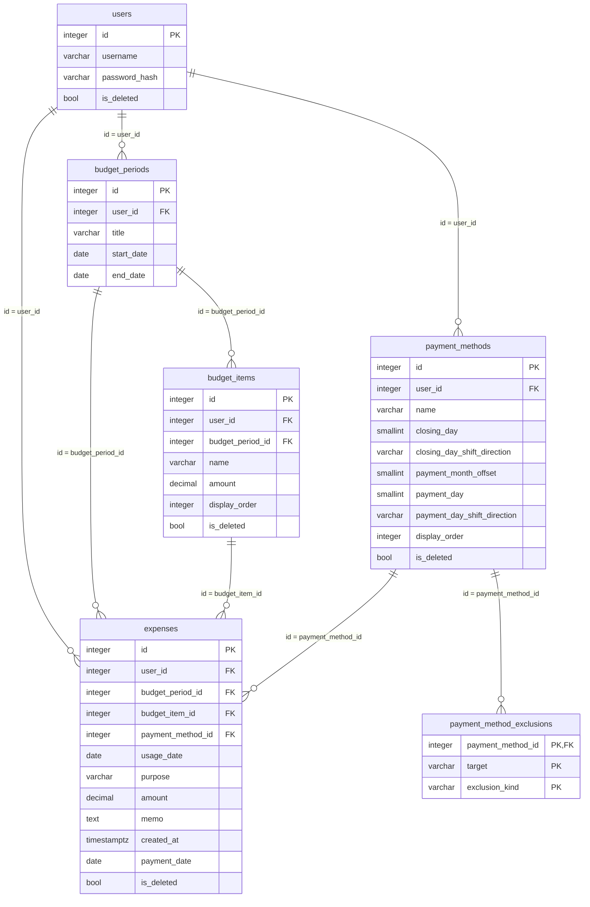

# expense-management DB設計

> API のパスや画面の詳細は書かない（`api-design.md` / `ui-design.md`）。

## 概要

- スキーマ: `expense_management`。予算期間、予算項目、支出方法、支出方法の除外条件、支出記録を置く。
- ユーザ、セッション、機能マスタ、メニュー割当はスキーマ `public` を読む。複製しない。列は増やさない。表の作成は `portal` が担う。
- ログはファイルへ出す。テーブルには置かない。

関連ドキュメント:

- 全体設計: `design.md`
- UI設計: `ui-design.md`
- API設計: `api-design.md`

## ER図

mermaid の erDiagram は `numeric` をそのまま書くとパースが崩れやすいため、図の中だけ `decimal` と書く。実体の型はテーブル設計どおり `numeric(12,2)` である。

## テーブル設計

### expense_management.budget_periods

目的: 利用者本人の予算期間。タイトルと開始日〜終了日を持つ。`title`・`start_date`・`end_date` は更新できる。削除機能は無い（要件に無い）。同一ユーザ内で期間が重なる行を複数持てる。

| カラム | 型 | NULL | 既定 | 説明 |
|--------|-----|------|------|------|
| `id` | integer | NOT NULL | シーケンス | PK |
| `user_id` | integer | NOT NULL | - | 所有者。`public.users.id` |
| `title` | varchar(255) | NOT NULL | - | タイトル。空は置かない |
| `start_date` | date | NOT NULL | - | 開始日 |
| `end_date` | date | NOT NULL | - | 終了日 |

制約:

- 主キー: `id`
- 一意: なし
- 外部キー: `user_id` → `public.users.id`（ON DELETE RESTRICT）
- 検査: `char_length(title) > 0`
- 検査: `end_date >= start_date`

インデックス:

- `(user_id, start_date, end_date)`（一覧の並び）

同一ユーザ内で期間が重なる行を複数追加できる（重複チェックは行わない）。更新時も同様に重複チェックは行わない。更新できるのは本人が所有する行（`user_id` が一致する行）のみ。`id`・`user_id` は変えない。

### expense_management.budget_items

目的: 予算期間に属する予算項目。項目名・金額・表示順を持つ。論理削除する（`expenses.budget_item_id` から参照され続けるため）。

| カラム | 型 | NULL | 既定 | 説明 |
|--------|-----|------|------|------|
| `id` | integer | NOT NULL | シーケンス | PK |
| `user_id` | integer | NOT NULL | - | 所有者。`public.users.id` |
| `budget_period_id` | integer | NOT NULL | - | 属する予算期間。`expense_management.budget_periods.id` |
| `name` | varchar(255) | NOT NULL | - | 項目名。空は置かない |
| `amount` | numeric(12,2) | NOT NULL | - | 予算金額。0以上 |
| `display_order` | integer | NOT NULL | - | 表示順 |
| `is_deleted` | boolean | NOT NULL | false | 論理削除なら true |

制約:

- 主キー: `id`
- 一意: なし
- 外部キー: `user_id` → `public.users.id`（ON DELETE RESTRICT）
- 外部キー: `budget_period_id` → `expense_management.budget_periods.id`（ON DELETE RESTRICT）
- 検査: `char_length(name) > 0`
- 検査: `amount >= 0`

インデックス:

- `(budget_period_id, display_order)` のうち `is_deleted = false`（一覧の表示順）

`user_id` は `budget_period_id` の所有者と一致させる。物理削除はしない。削除済み項目は一覧に出ない。既存の支出記録が参照する `budget_item_id` は、項目の削除後も変えない。複製作成（REQ-002）では、複製元の未削除の予算項目をコピーして新しい `id` で追加する（`budget_period_id` は複製先）。

### expense_management.payment_methods

目的: 利用者本人の支出方法。締め日・支払月オフセット・支払日と、締め日用・支払日用それぞれのずらし方向・除外条件を持つ。論理削除する（`expenses.payment_method_id` から参照され続けるため）。

| カラム | 型 | NULL | 既定 | 説明 |
|--------|-----|------|------|------|
| `id` | integer | NOT NULL | シーケンス | PK |
| `user_id` | integer | NOT NULL | - | 所有者。`public.users.id` |
| `name` | varchar(255) | NOT NULL | - | 名称。空は置かない |
| `closing_day` | smallint | NOT NULL | - | 締め日（基準値）。0〜31。0は即時支払 |
| `closing_day_shift_direction` | varchar(16) | NULL | - | 締め日用のずらし方向。`earlier`（過去）または `later`（未来）。`closing_day = 0` のときは NULL |
| `payment_month_offset` | smallint | NOT NULL | - | 支払月オフセット。0以上。`closing_day = 0` のときは固定値 0 |
| `payment_day` | smallint | NOT NULL | - | 支払日（基準値）。1〜31。`closing_day = 0` のときは固定値 0（利用日と同日を表す） |
| `payment_day_shift_direction` | varchar(16) | NULL | - | 支払日用のずらし方向。`earlier`（過去）または `later`（未来）。`closing_day = 0` のときは NULL |
| `display_order` | integer | NOT NULL | - | 表示順 |
| `is_deleted` | boolean | NOT NULL | false | 論理削除なら true |

制約:

- 主キー: `id`
- 一意: なし
- 外部キー: `user_id` → `public.users.id`（ON DELETE RESTRICT）
- 検査: `closing_day` は 0〜31
- 検査: `closing_day = 0` のとき `payment_month_offset = 0` かつ `payment_day = 0` かつ `closing_day_shift_direction IS NULL` かつ `payment_day_shift_direction IS NULL`
- 検査: `closing_day > 0` のとき `payment_month_offset >= 0` かつ `payment_day` は 1〜31 かつ `closing_day_shift_direction IN ('earlier', 'later')` かつ `payment_day_shift_direction IN ('earlier', 'later')`

インデックス:

- `(user_id, display_order)` のうち `is_deleted = false`（一覧の表示順）

物理削除はしない。削除済みの支出方法は一覧・選択肢に出ない。既存の支出記録が参照する `payment_method_id` は、削除後も変えない。`closing_day` を 0 に変更したときは、`payment_month_offset` / `payment_day` を固定値（0, 0）に更新し、`closing_day_shift_direction` / `payment_day_shift_direction` を NULL にし、`payment_method_exclusions` の行をすべて削除する。

### expense_management.payment_method_exclusions

目的: 支出方法の除外条件。締め日用（`target = 'closing_day'`）と支払日用（`target = 'payment_day'`）を区別して持つ。それぞれ「特定の曜日」「当月に存在しない日」または「祝日」のいずれか。締め日が0の支出方法には行を置かない。

| カラム | 型 | NULL | 既定 | 説明 |
|--------|-----|------|------|------|
| `payment_method_id` | integer | NOT NULL | - | 対象の支出方法。`expense_management.payment_methods.id` |
| `target` | varchar(16) | NOT NULL | - | `closing_day`（締め日用）または `payment_day`（支払日用） |
| `exclusion_kind` | varchar(16) | NOT NULL | - | `sunday`〜`saturday`のいずれか（特定の曜日）、`nonexistent_day`（当月に存在しない日）、または `holiday`（日本の国民の祝日。`jpholiday` で判定し、日付そのものはDBに保存しない） |

制約:

- 主キー: `(payment_method_id, target, exclusion_kind)`
- 一意: なし（PK のみ）
- 外部キー: `payment_method_id` → `expense_management.payment_methods.id`（ON DELETE RESTRICT）
- 検査: `target IN ('closing_day', 'payment_day')`
- 検査: `exclusion_kind IN ('sunday', 'monday', 'tuesday', 'wednesday', 'thursday', 'friday', 'saturday', 'nonexistent_day', 'holiday')`

インデックス:

- `(payment_method_id)`（PK に付随）

所有者は `payment_method_id` の所有者に一致する（本表に `user_id` は持たない）。同一の `target` × 除外条件種別は支出方法ごとに1行まで（PK で保証）。更新時は置き換える（不要な行は物理削除してよい）。`payment_methods.closing_day = 0` の行に対しては行を置かない（`target` を問わず）。`exclusion_kind` の検査制約への `holiday` 追加は、既存 DB に対しては制約の DROP・再 ADD で行う（新しい DDL ファイルを追加する。`01_expense_management.sql` は変えない）。

### expense_management.expenses

目的: 利用者本人の支出記録。論理削除する（削除フラグ）。

| カラム | 型 | NULL | 既定 | 説明 |
|--------|-----|------|------|------|
| `id` | integer | NOT NULL | シーケンス | PK |
| `user_id` | integer | NOT NULL | - | 所有者。`public.users.id` |
| `budget_period_id` | integer | NULL | - | 予算。`expense_management.budget_periods.id`。「予算なし」のとき NULL |
| `budget_item_id` | integer | NULL | - | 予算区分。`expense_management.budget_items.id`。`budget_period_id` が NULL のとき NULL |
| `payment_method_id` | integer | NOT NULL | - | 支出方法。`expense_management.payment_methods.id` |
| `usage_date` | date | NOT NULL | - | 利用日 |
| `purpose` | varchar(255) | NOT NULL | - | 用途。空は置かない |
| `amount` | numeric(12,2) | NOT NULL | - | 金額。0以上 |
| `memo` | text | NULL | - | メモ。空は NULL |
| `created_at` | timestamptz | NOT NULL | 現在時刻 | 入力日時。システムが自動記録し、以後変えない |
| `payment_date` | date | NOT NULL | - | 支払日。登録時は自動算出値、以後はユーザが上書きした値 |
| `is_deleted` | boolean | NOT NULL | false | 削除フラグ。true なら削除済み |

制約:

- 主キー: `id`
- 一意: なし
- 外部キー: `user_id` → `public.users.id`（ON DELETE RESTRICT）
- 外部キー: `budget_period_id` → `expense_management.budget_periods.id`（ON DELETE RESTRICT）
- 外部キー: `budget_item_id` → `expense_management.budget_items.id`（ON DELETE RESTRICT）
- 外部キー: `payment_method_id` → `expense_management.payment_methods.id`（ON DELETE RESTRICT）
- 検査: `char_length(purpose) > 0`
- 検査: `amount >= 0`
- 検査: `budget_period_id IS NOT NULL OR budget_item_id IS NULL`（予算が「予算なし」のとき、予算区分も持たない）

インデックス:

- `(user_id, usage_date)` のうち `is_deleted = false`（利用日基準の集計・一覧）
- `(user_id, payment_date)` のうち `is_deleted = false`（支払発生月基準の集計）
- `(user_id, budget_period_id)` のうち `is_deleted = false`（予算による一覧の絞り込み）
- `(budget_item_id)` のうち `is_deleted = false`（予算項目ごとの集計）

`budget_period_id` を指定するときは本人の予算期間だけを指定できる。`budget_item_id` を指定するときは、本人の未削除の予算項目であり、かつその `budget_period_id` に属する予算項目でなければならない。`budget_period_id` が NULL（予算なし）のとき、`budget_item_id` も NULL にする。`payment_method_id` は追加・更新時に本人の未削除の支出方法だけを指定できる。削除済みの予算項目・支出方法が既に付いている既存行は残してよい（`budget_item_id` / `payment_method_id` は変えない）。`created_at` は追加時にシステムが設定し、以後変えない。`payment_date` は追加・更新時に自動算出した値を初期値とし、ユーザが上書きできる。物理削除はしない。一覧・集計は `is_deleted = false` の行だけを対象とする。予算項目ごとの集計（REQ-011・012）は `budget_item_id` が NULL の行を対象に含めない。

## 関連

- `users` 1 対 多 `budget_periods`。削除機能は無い。
- `users` 1 対 多 `payment_methods`。物理削除しない。
- `users` 1 対 多 `expenses`。論理削除する（削除フラグ）。
- `budget_periods` 1 対 多 `budget_items`。予算期間の削除機能は無いため、予算期間削除時の扱いは無い。
- `budget_periods` 1 対 多 `expenses`（`budget_period_id`）。予算期間の削除機能は無いため、予算期間削除時の扱いは無い。`budget_period_id` は NULL（予算なし）を許容する。
- `payment_methods` 1 対 多 `payment_method_exclusions`。締め日を0に変更、または支出方法を削除したときに除外条件行を削除してよい。
- `budget_items` 1 対 多 `expenses`（`budget_item_id`）。予算項目の論理削除では支出記録の `budget_item_id` を維持する。`budget_item_id` は NULL（予算区分なし）を許容する。
- `payment_methods` 1 対 多 `expenses`（`payment_method_id`）。支出方法の論理削除では支出記録の `payment_method_id` を維持する。

## 要件トレーサビリティ

| 要件 | 設計 |
|------|------|
| REQ-001 | `budget_periods` への挿入（`title` 含む）。重複チェックは行わない |
| REQ-002 | `budget_periods` への挿入（`title` 含む）、`budget_items` の複製挿入 |
| REQ-003 | `budget_items` の挿入・更新・論理削除 |
| REQ-004 | `budget_periods` の一覧（`title` 含む）、`budget_items` の `(budget_period_id, display_order)` |
| REQ-005 | `payment_methods` への挿入。`closing_day = 0` のときの固定値検査。`payment_method_exclusions` への挿入（`target` ごと） |
| REQ-006 | `payment_methods` の更新・論理削除。`closing_day` を0に変更したときの固定値更新と `payment_method_exclusions` の削除 |
| REQ-007 | `payment_methods` の一覧（`is_deleted = false`、`display_order` 順） |
| REQ-008 | `expenses` への挿入（`budget_period_id`・`budget_item_id` を含む。予算なしは両方 NULL）。`created_at` の自動設定。`payment_date` の初期値は算出値 |
| REQ-009 | `expenses` の更新（`budget_period_id`・`budget_item_id` の変更を含む）・論理削除（`is_deleted`） |
| REQ-010 | `expenses` の一覧（`is_deleted = false`）。`budget_period_id` による絞り込み（NULL＝予算なしを含む） |
| REQ-011 | `expenses.usage_date` と `budget_periods` の期間、`budget_items.amount` との集計（`is_deleted = false`） |
| REQ-012 | `expenses.payment_date` の年月による集計（`is_deleted = false`） |
| REQ-013 | `payment_methods` の `closing_day` / `closing_day_shift_direction` / `payment_day` / `payment_day_shift_direction`、`payment_method_exclusions`（`target` で締め日用・支払日用を区別）。テーブルとしては保持のみで、算出はバックエンドの `closing_date_service` |
| REQ-014 | `budget_periods` の `title` / `start_date` / `end_date` の更新（`user_id` が一致する行のみ）。重複チェックは行わない |

## 未決事項

なし

## 承認

現在の状態: 承認済み

| 日時 | 状態 | 変更概要 |
|------|------|----------|
| 2026-09-18 | 未承認 | 初版 |
| 2026-09-18 | 未承認 | 支払日にも除外条件・ずらし方向を適用できるよう、`payment_methods` に `payment_day_shift_direction` を追加し、`payment_method_exclusions` に `target`（締め日用/支払日用の区別）を追加 |
| 2026-09-18 | 未承認 | `payment_methods` に `display_order` を追加。`expenses` を物理削除から論理削除（`is_deleted`）に変更し、関連インデックスを更新 |
| 2026-09-18 | 承認済み | `payment_methods.display_order` と `expenses` の論理削除を含む DB 設計を承認 |
| 2026-09-18 | 未承認 | `budget_periods` に `title` を追加。期間重複チェックを撤廃し、同一ユーザ内で期間が重なる行を複数許容 |
| 2026-09-18 | 承認済み | `budget_periods.title` の追加と期間重複チェック撤廃を承認 |
| 2026-09-18 | 未承認 | `budget_periods` の `title`・`start_date`・`end_date` を更新できることを明記（REQ-014）。列追加は無し |
| 2026-09-18 | 承認済み | `budget_periods` の更新対応を承認 |
| 2026-09-18 | 未承認 | `payment_method_exclusions.exclusion_kind` の検査制約に `holiday` を追加。既存DBへは制約のDROP・再ADDで反映（新DDLファイル、`01_expense_management.sql`は変えない） |
| 2026-09-18 | 承認済み | `exclusion_kind` への `holiday` 追加を承認 |
| 2026-09-19 20:14 | 未承認 | `expenses` に `budget_period_id`（NULL 可、予算なし＝NULL）を追加。`budget_item_id` を NOT NULL から NULL 許容へ変更し、検査制約 `budget_period_id IS NOT NULL OR budget_item_id IS NULL` を追加。`(user_id, budget_period_id)` のインデックスを追加。既存 DDL は変えず新DDLファイルで反映（既存行は `budget_items.budget_period_id` から `budget_period_id` を補完） |
| 2026-09-19 20:48 | 承認済み | `expenses.budget_period_id` の追加を承認 |
