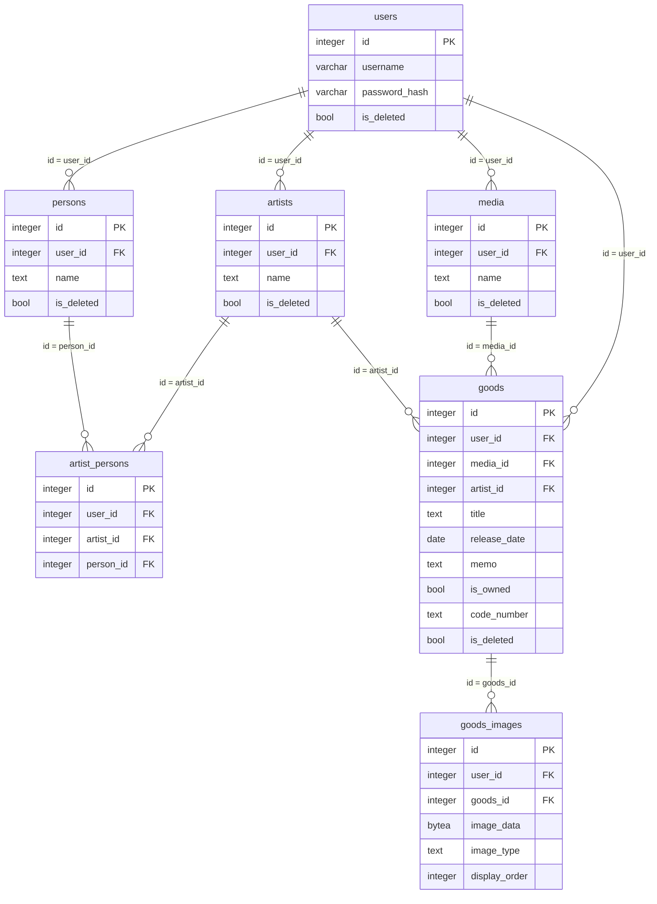

# goods-management DB設計

> API のパスや画面の詳細は書かない（`api-design.md` / `ui-design.md`）。

## 概要

- スキーマ: `goods_management`。人物・アーティスト・媒体・商品・商品画像・アーティストと人物の関連を置く。
- ユーザ、セッション、機能マスタ、メニュー割当はスキーマ `public` を読む。複製しない。列は増やさない。表の作成は `portal` が担う。
- API キー（`public.api_keys`）は、API キーによる認証のために読み、許可したときに最終利用日時（`last_used_at`）だけを更新する。複製しない。列は増やさない。表の作成は `api-key-management` が担う（列と制約は `specs/api-key-management/db-design.md`）。
- ログはファイルへ出す。テーブルには置かない。
- 人物・アーティスト・媒体・商品は論理削除する（削除フラグ）。アーティストと人物の関連は、関連の追加・削除そのものが操作対象のため論理削除は持たず、行の追加・削除で管理する。

関連ドキュメント:

- 全体設計: `design.md`
- UI設計: `ui-design.md`
- API設計: `api-design.md`

## ER図

## テーブル設計

### goods_management.persons

目的: 利用者本人の人物（応援する対象個人）。論理削除する（削除フラグ）。

| カラム | 型 | NULL | 既定 | 説明 |
|--------|-----|------|------|------|
| `id` | integer | NOT NULL | シーケンス | PK |
| `user_id` | integer | NOT NULL | - | 所有者。`public.users.id` |
| `name` | text | NOT NULL | - | 名称。空は置かない |
| `is_deleted` | boolean | NOT NULL | false | 削除フラグ。true なら削除済み |

制約:

- 主キー: `id`
- 一意: なし（名称の重複可否は制御しない）
- 外部キー: `user_id` → `public.users.id`（ON DELETE RESTRICT）
- 検査: `char_length(name) > 0`

インデックス:

- `(user_id)` のうち `is_deleted = false`（一覧）

### goods_management.artists

目的: 利用者本人のアーティスト（人物が所属するグループ・ユニットなど）。論理削除する（削除フラグ）。

| カラム | 型 | NULL | 既定 | 説明 |
|--------|-----|------|------|------|
| `id` | integer | NOT NULL | シーケンス | PK |
| `user_id` | integer | NOT NULL | - | 所有者。`public.users.id` |
| `name` | text | NOT NULL | - | 名称。空は置かない |
| `is_deleted` | boolean | NOT NULL | false | 削除フラグ。true なら削除済み |

制約:

- 主キー: `id`
- 一意: なし
- 外部キー: `user_id` → `public.users.id`（ON DELETE RESTRICT）
- 検査: `char_length(name) > 0`

インデックス:

- `(user_id)` のうち `is_deleted = false`（一覧）

### goods_management.artist_persons

目的: アーティストと、それに所属する人物の関連（多対多）。関連自体の論理削除は持たない（追加・削除で管理する）。

| カラム | 型 | NULL | 既定 | 説明 |
|--------|-----|------|------|------|
| `id` | integer | NOT NULL | シーケンス | PK |
| `user_id` | integer | NOT NULL | - | 所有者。`public.users.id`（`artist_id`・`person_id` の所有者と一致させる） |
| `artist_id` | integer | NOT NULL | - | `goods_management.artists.id` |
| `person_id` | integer | NOT NULL | - | `goods_management.persons.id` |

制約:

- 主キー: `id`
- 一意: `(artist_id, person_id)`
- 外部キー: `user_id` → `public.users.id`（ON DELETE RESTRICT）
- 外部キー: `artist_id` → `goods_management.artists.id`（ON DELETE RESTRICT）
- 外部キー: `person_id` → `goods_management.persons.id`（ON DELETE RESTRICT）

インデックス:

- `(artist_id)`（アーティスト詳細での所属人物一覧）
- `(person_id)`（人物削除時の参照確認）

アーティストまたは人物を論理削除しても、この表の行は削除しない（`artists.is_deleted` / `persons.is_deleted` 側で参照制約を判定する）。

### goods_management.media

目的: 利用者本人の媒体（商品が属するシリーズ・作品・レーベルなど）。論理削除する（削除フラグ）。

| カラム | 型 | NULL | 既定 | 説明 |
|--------|-----|------|------|------|
| `id` | integer | NOT NULL | シーケンス | PK |
| `user_id` | integer | NOT NULL | - | 所有者。`public.users.id` |
| `name` | text | NOT NULL | - | 名称。空は置かない |
| `is_deleted` | boolean | NOT NULL | false | 削除フラグ。true なら削除済み |

制約:

- 主キー: `id`
- 一意: なし
- 外部キー: `user_id` → `public.users.id`（ON DELETE RESTRICT）
- 検査: `char_length(name) > 0`

インデックス:

- `(user_id)` のうち `is_deleted = false`（一覧）

### goods_management.goods

目的: 利用者本人の商品（収集対象のグッズ本体）。論理削除する（削除フラグ）。

| カラム | 型 | NULL | 既定 | 説明 |
|--------|-----|------|------|------|
| `id` | integer | NOT NULL | シーケンス | PK |
| `user_id` | integer | NOT NULL | - | 所有者。`public.users.id` |
| `media_id` | integer | NOT NULL | - | 所属する媒体。`goods_management.media.id` |
| `artist_id` | integer | NOT NULL | - | 紐づくアーティスト。`goods_management.artists.id` |
| `title` | text | NOT NULL | - | タイトル。空は置かない |
| `release_date` | date | NOT NULL | - | リリース日。登録時未指定なら登録日を設定する |
| `memo` | text | NULL | - | メモ。任意 |
| `is_owned` | boolean | NOT NULL | false | 所持フラグ |
| `code_number` | text | NULL | - | 品番。任意 |
| `is_deleted` | boolean | NOT NULL | false | 削除フラグ。true なら削除済み |

制約:

- 主キー: `id`
- 一意: なし
- 外部キー: `user_id` → `public.users.id`（ON DELETE RESTRICT）
- 外部キー: `media_id` → `goods_management.media.id`（ON DELETE RESTRICT）
- 外部キー: `artist_id` → `goods_management.artists.id`（ON DELETE RESTRICT）
- 検査: `char_length(title) > 0`

インデックス:

- `(user_id, artist_id)` のうち `is_deleted = false`（人物選択時の関連アーティスト絞り込み、アーティスト削除時の参照確認、商品一覧のアーティスト条件）
- `(user_id, media_id)` のうち `is_deleted = false`（人物選択時の関連媒体絞り込み、媒体削除時の参照確認、商品一覧の媒体条件）

### goods_management.goods_images

目的: 商品に添付する画像（1商品に複数登録できる）。商品自体を論理削除しても、この表の行は削除しない。

| カラム | 型 | NULL | 既定 | 説明 |
|--------|-----|------|------|------|
| `id` | integer | NOT NULL | シーケンス | PK |
| `user_id` | integer | NOT NULL | - | 所有者。`public.users.id`（`goods_id` の所有者と一致させる） |
| `goods_id` | integer | NOT NULL | - | `goods_management.goods.id` |
| `image_data` | bytea | NOT NULL | - | 画像データ本体 |
| `image_type` | text | NOT NULL | - | MIME タイプ（`image/png` または `image/jpeg`） |
| `display_order` | integer | NOT NULL | - | 表示順（登録順に自動採番）。値が小さいほど先 |

制約:

- 主キー: `id`
- 一意: なし
- 外部キー: `user_id` → `public.users.id`（ON DELETE RESTRICT）
- 外部キー: `goods_id` → `goods_management.goods.id`（ON DELETE RESTRICT）

インデックス:

- `(goods_id)`（商品詳細での画像一覧、表示順採番）

## 関連

- `users` 1 対 多 `persons` / `artists` / `media` / `goods`。いずれも論理削除する（削除フラグ）。
- `artists` 多 対 多 `persons`（`artist_persons` 経由）。人物の削除は、その人物を参照する未削除の `artist_persons` 行があるとき失敗する（アプリケーション層で判定）。
- `artists` 1 対 多 `goods`（`artist_id`）。アーティストの削除は、そのアーティストを参照する未削除の `goods` 行があるとき失敗する（アプリケーション層で判定）。
- `media` 1 対 多 `goods`（`media_id`）。媒体の削除は、その媒体を参照する未削除の `goods` 行があるとき失敗する（アプリケーション層で判定）。
- `goods` 1 対 多 `goods_images`（`goods_id`）。商品の削除（論理削除）では画像行を削除しない。

## 要件トレーサビリティ

| 要件 | 設計 |
|------|------|
| REQ-001 | テーブルなし（`public` のユーザ・機能マスタ・メニュー割当・API キーを参照。API キーは最終利用日時を更新） |
| REQ-002 | 各テーブルの `user_id` による絞り込み |
| REQ-003 | `persons` への挿入 |
| REQ-004 | `persons` の一覧（`user_id` 一致、`is_deleted = false`） |
| REQ-005 | `persons` の名称更新 |
| REQ-006 | `persons` の論理削除。`artist_persons` の参照確認（アプリケーション層） |
| REQ-007 | `artists` への挿入、`artist_persons` への挿入 |
| REQ-008 | `artists` の一覧（`user_id` 一致、`is_deleted = false`） |
| REQ-009 | `artists` の単件取得と `artist_persons` 経由の所属人物一覧 |
| REQ-010 | `artists` の名称更新、`artist_persons` の追加・削除 |
| REQ-011 | `artists` の論理削除。`goods.artist_id` の参照確認（アプリケーション層） |
| REQ-012 | `media` への挿入 |
| REQ-013 | `media` の一覧（`user_id` 一致、`is_deleted = false`） |
| REQ-014 | `media` の名称更新 |
| REQ-015 | `media` の論理削除。`goods.media_id` の参照確認（アプリケーション層） |
| REQ-016 | `artist_persons` 経由の関連アーティスト取得、`goods.media_id` 経由の関連媒体取得 |
| REQ-017 | `goods` の条件（`user_id`・`artist_id`・`media_id`）付き一覧 |
| REQ-018 | テーブルなし（フロントエンド内のタイトル絞り込み） |
| REQ-019 | `goods` の単件取得、`goods_images` の一覧（`goods_id` 一致） |
| REQ-020 | `goods` への挿入。未指定の `release_date` は登録日を設定 |
| REQ-021 | `goods` の更新 |
| REQ-022 | `goods_images` への挿入（`display_order` 自動採番）・削除 |
| REQ-023 | `goods` の論理削除。`goods_images` は削除しない |
| REQ-024 | テーブルなし（ファイルログ） |

## 未決事項

- なし

## 承認

現在の状態: 承認済み

| 日時 | 状態 | 変更概要 |
|------|------|----------|
| 2026-09-20 | 未承認 | 初版 |
| 2026-09-20 | 承認済み | 初版を承認 |
| 2026-09-26 00:43 | 未承認 | `public.api_keys` の参照と `last_used_at` の更新を追加（API キーによる認証）。本機能の DDL 変更なし |
| 2026-09-26 00:44 | 承認済み | API キー認証への対応を承認 |
