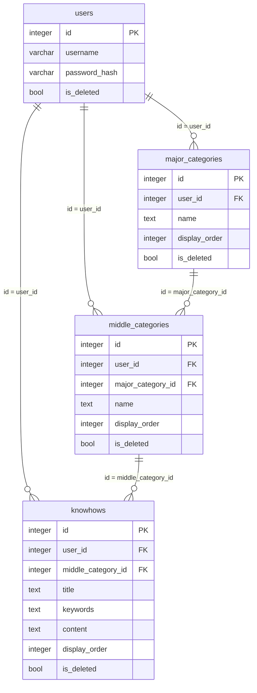

# knowhow-management DB設計

> API のパスや画面の詳細は書かない（`api-design.md` / `ui-design.md`）。

## 概要

- スキーマ: `knowhow_management`。大項目・中項目・ノウハウを置く。
- ユーザ、セッション、機能マスタ、メニュー割当はスキーマ `public` を読む。複製しない。列は増やさない。表の作成は `portal` が担う。
- API キー（`public.api_keys`）は、API キーによる認証のために読み、許可したときに最終利用日時（`last_used_at`）だけを更新する。複製しない。列は増やさない。表の作成は `api-key-management` が担う（列と制約は `specs/api-key-management/db-design.md`）。
- ログはファイルへ出す。テーブルには置かない。

関連ドキュメント:

- 全体設計: `design.md`
- UI設計: `ui-design.md`
- API設計: `api-design.md`

## ER図

## テーブル設計

### knowhow_management.major_categories

目的: 利用者本人の大項目（最上位の分類）。論理削除する（削除フラグ）。

| カラム | 型 | NULL | 既定 | 説明 |
|--------|-----|------|------|------|
| `id` | integer | NOT NULL | シーケンス | PK |
| `user_id` | integer | NOT NULL | - | 所有者。`public.users.id` |
| `name` | text | NOT NULL | - | 名称。空は置かない |
| `display_order` | integer | NOT NULL | - | 表示順。値が小さいほど先 |
| `is_deleted` | boolean | NOT NULL | false | 削除フラグ。true なら削除済み |

制約:

- 主キー: `id`
- 一意: `(user_id, name)` のうち `is_deleted = false` の行だけ（部分一意。論理削除済み同士、および削除済みと同じ名称の未削除は可）
- 外部キー: `user_id` → `public.users.id`（ON DELETE RESTRICT）
- 検査: `char_length(name) > 0`

インデックス:

- 部分一意に付随する `(user_id, name)` のうち `is_deleted = false`（登録・名称変更時の重複判定）
- `(user_id)` のうち `is_deleted = false`（一覧）

### knowhow_management.middle_categories

目的: 利用者本人の中項目（大項目にぶら下がる分類）。論理削除する（削除フラグ）。

| カラム | 型 | NULL | 既定 | 説明 |
|--------|-----|------|------|------|
| `id` | integer | NOT NULL | シーケンス | PK |
| `user_id` | integer | NOT NULL | - | 所有者。`public.users.id` |
| `major_category_id` | integer | NOT NULL | - | 親の大項目。`knowhow_management.major_categories.id` |
| `name` | text | NOT NULL | - | 名称。空は置かない |
| `display_order` | integer | NOT NULL | - | 表示順（大項目内）。値が小さいほど先 |
| `is_deleted` | boolean | NOT NULL | false | 削除フラグ。true なら削除済み |

制約:

- 主キー: `id`
- 一意: `(major_category_id, name)` のうち `is_deleted = false` の行だけ（部分一意）
- 外部キー: `user_id` → `public.users.id`（ON DELETE RESTRICT）
- 外部キー: `major_category_id` → `knowhow_management.major_categories.id`（ON DELETE RESTRICT）
- 検査: `char_length(name) > 0`

インデックス:

- 部分一意に付随する `(major_category_id, name)` のうち `is_deleted = false`（登録・名称変更時の重複判定）
- `(major_category_id)` のうち `is_deleted = false`（大項目内の一覧）
- `(user_id)` のうち `is_deleted = false`

### knowhow_management.knowhows

目的: 利用者本人のノウハウ（中項目に属する記事。中項目未指定＝未分類も可）。論理削除する（削除フラグ）。

| カラム | 型 | NULL | 既定 | 説明 |
|--------|-----|------|------|------|
| `id` | integer | NOT NULL | シーケンス | PK |
| `user_id` | integer | NOT NULL | - | 所有者。`public.users.id` |
| `middle_category_id` | integer | NULL | - | 所属する中項目。`knowhow_management.middle_categories.id`。NULL は未分類 |
| `title` | text | NOT NULL | - | タイトル。空は置かない |
| `keywords` | text | NULL | - | キーワード。任意 |
| `content` | text | NOT NULL | - | 本文。空は置かない |
| `display_order` | integer | NOT NULL | - | 表示順（同一利用者・同一所属先内）。値が小さいほど先 |
| `is_deleted` | boolean | NOT NULL | false | 削除フラグ。true なら削除済み |

制約:

- 主キー: `id`
- 一意: なし
- 外部キー: `user_id` → `public.users.id`（ON DELETE RESTRICT）
- 外部キー: `middle_category_id` → `knowhow_management.middle_categories.id`（ON DELETE RESTRICT）
- 検査: `char_length(title) > 0`
- 検査: `char_length(content) > 0`

インデックス:

- `(user_id, middle_category_id)` のうち `is_deleted = false`（中項目内の一覧、表示順の採番・交換。`middle_category_id` が NULL の未分類行も対象に含む）
- `(user_id)` のうち `is_deleted = false`（キーワード検索）

`title` / `keywords` / `content` を対象にしたキーワード検索は、大文字小文字を区別しない部分一致（`ILIKE`）で行う。専用の索引は持たない。

## 関連

- `users` 1 対 多 `major_categories`。論理削除する（削除フラグ）。
- `users` 1 対 多 `middle_categories`。論理削除する（削除フラグ）。
- `users` 1 対 多 `knowhows`。論理削除する（削除フラグ）。
- `major_categories` 1 対 多 `middle_categories`（`major_category_id`）。大項目の削除時は、その下の未削除の中項目も論理削除する（アプリケーション層で連鎖させる。DB のカスケード削除は使わない）。
- `middle_categories` 1 対 多 `knowhows`（`middle_category_id`）。中項目の削除時は、その下の未削除のノウハウも論理削除する（同様にアプリケーション層で連鎖させる）。`middle_category_id` が NULL（未分類）のノウハウは、中項目の削除の影響を受けない。

## 要件トレーサビリティ

| 要件 | 設計 |
|------|------|
| REQ-001 | テーブルなし（`public` のユーザ・機能マスタ・メニュー割当・API キーを参照。API キーは最終利用日時を更新） |
| REQ-002 | 各テーブルの `user_id` による絞り込み |
| REQ-003 | `major_categories` への挿入。`(user_id, name)` の部分一意で重複判定 |
| REQ-004 | `major_categories` の名称更新。部分一意で重複判定（自身除外） |
| REQ-005 | `major_categories` の論理削除。配下の `middle_categories`・`knowhows` も連鎖して論理削除 |
| REQ-006 | `middle_categories` への挿入。`(major_category_id, name)` の部分一意で重複判定 |
| REQ-007 | `middle_categories` の名称更新。部分一意で重複判定（自身除外） |
| REQ-008 | `middle_categories` の論理削除。配下の `knowhows` も連鎖して論理削除 |
| REQ-009 | `knowhows` の一覧（`middle_category_id` 一致、`is_deleted = false`、`display_order` 順） |
| REQ-010 | `knowhows` の単件取得（`is_deleted = false`） |
| REQ-011 | `knowhows` への挿入。`(user_id, middle_category_id)` スコープで `display_order` を採番 |
| REQ-012 | `knowhows` の更新。所属先変更時は `display_order` を再採番 |
| REQ-013 | `knowhows` の論理削除 |
| REQ-014 | `knowhows.display_order` の交換（同一所属先内の2件） |
| REQ-015 | `knowhows` の `title`/`keywords`/`content` を対象にした `ILIKE` 検索（`user_id` 全体、`is_deleted = false`） |
| REQ-016 | テーブルなし（ファイルログ） |

## 未決事項

- なし

## 承認

現在の状態: 承認済み

| 日時 | 状態 | 変更概要 |
|------|------|----------|
| 2026-09-20 10:43 | 未承認 | 初版 |
| 2026-09-20 10:44 | 承認済み | 初版を承認 |
| 2026-09-26 00:43 | 未承認 | `public.api_keys` の参照と `last_used_at` の更新を追加（API キーによる認証）。本機能の DDL 変更なし |
| 2026-09-26 00:44 | 承認済み | API キー認証への対応を承認 |
