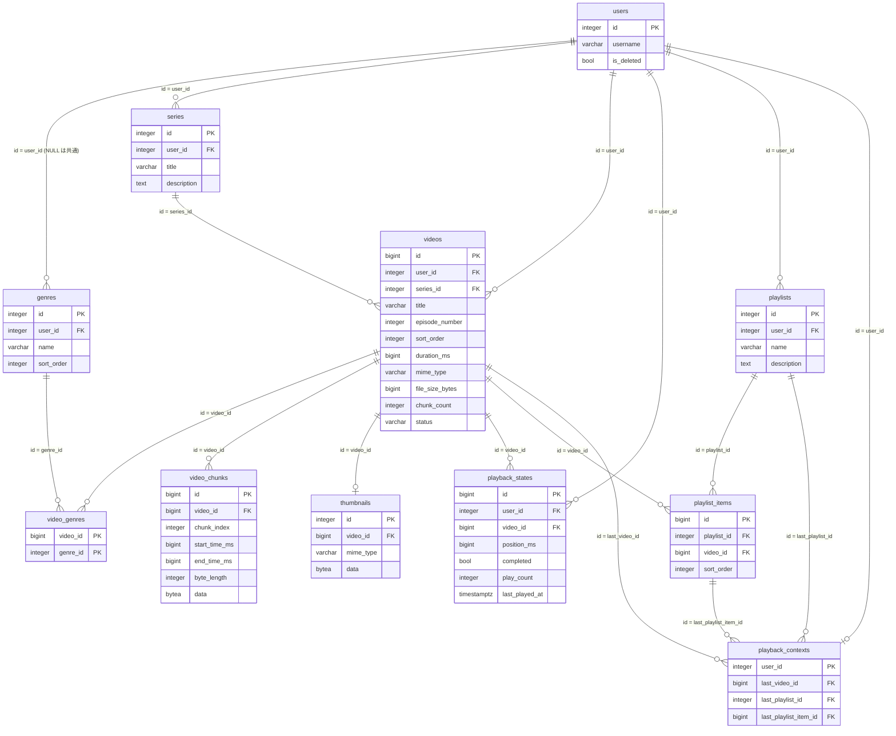

# movie-management DB設計

> API のパスや画面の詳細は書かない（`api-design.md` / `ui-design.md`）。
> 機能固有テーブルはスキーマ `movie_management`（snake_case）に置く。`public` に業務テーブルを増やさない。

## 概要

- スキーマ: `movie_management`。動画・動画ファイルのチャンク・サムネイル・作品・ジャンル・プレイリスト・再生状態・続きから視聴の情報を置く。
- ユーザ、セッション、システム設定、機能マスタ、メニュー割当はスキーマ `public` を読む。複製しない。列は増やさない。表の作成は `portal` が担う。
- 所有者は `user_id`（`public.users.id`）で表す。移行元の `aid`（アカウント ID）は、移行時にユーザ名の一致で `user_id` に対応付ける（`design.md` の移行プログラム）。
- 動画ファイルは、約 4 MB のチャンクに分割し、`video_chunks` に 1 チャンク 1 行で保管する（`bytea`）。移行元と同じ保管方式である。
- 削除は物理削除とする（要件 REQ-008）。動画の削除は、参照制約の連鎖で、チャンク・サムネイル・ジャンルとの関連・再生状態・プレイリストの項目を削除する。続きから視聴の参照は解除（NULL）にする。
- 移行のための専用列・専用テーブルは持たない。移行済みの判定は、既存の列（利用者・タイトル・ファイルサイズ・再生時間など）の一致で行う（`design.md`）。
- ログはファイルへ出す。テーブルには置かない。
- DDL は `backend/sql/01_movie_management.sql`。識別子は `integer GENERATED BY DEFAULT AS IDENTITY`（動画・チャンク・再生状態・プレイリスト項目は `bigint`）とする。日時は `timestamptz`。

関連ドキュメント:

- 全体設計: `design.md`
- UI設計: `ui-design.md`
- API設計: `api-design.md`

## ER図

## テーブル設計

### movie_management.genres

目的: ジャンル。`user_id` が NULL の行は全利用者共通のジャンル、値のある行は利用者独自のジャンル。

| カラム | 型 | NULL | 既定 | 説明 |
|--------|-----|------|------|------|
| `id` | integer | NOT NULL | IDENTITY | PK |
| `user_id` | integer | NULL | - | 所有者。`public.users.id`。NULL は共通ジャンル |
| `name` | varchar(100) | NOT NULL | - | ジャンル名。空は置かない |
| `sort_order` | integer | NOT NULL | 0 | 表示順。値が小さいほど先 |
| `created_at` | timestamptz | NOT NULL | now() | 作成日時 |
| `updated_at` | timestamptz | NOT NULL | now() | 更新日時 |

制約:

- 主キー: `id`
- 一意: 共通ジャンルは `(name)`（`user_id IS NULL` の行だけ）。独自ジャンルは `(user_id, name)`（`user_id IS NOT NULL` の行だけ）。いずれも部分一意（`NULL` は通常の一意制約では重複できてしまうため、部分一意に分ける）
- 外部キー: `user_id` → `public.users.id`（ON DELETE RESTRICT）
- 検査: `char_length(name) > 0`、`sort_order >= 0`

インデックス:

- 部分一意 2 件（上記）
- `(sort_order, id)`（一覧の並び）

初期データ（共通ジャンル。`user_id` は NULL）:

| name | sort_order |
|------|-----------|
| 洋画 | 1 |
| 邦画 | 2 |
| アニメ | 3 |
| ライブ | 4 |
| ドラマ | 5 |
| ドキュメンタリー | 6 |
| その他 | 99 |

### movie_management.series

目的: 利用者本人の作品（複数話で構成される動画のまとまり）。

| カラム | 型 | NULL | 既定 | 説明 |
|--------|-----|------|------|------|
| `id` | integer | NOT NULL | IDENTITY | PK |
| `user_id` | integer | NOT NULL | - | 所有者。`public.users.id` |
| `title` | varchar(500) | NOT NULL | - | 作品のタイトル。空は置かない |
| `description` | text | NULL | - | 作品の説明 |
| `created_at` | timestamptz | NOT NULL | now() | 作成日時 |
| `updated_at` | timestamptz | NOT NULL | now() | 更新日時 |

制約:

- 主キー: `id`
- 一意: なし（同名の作品を許す。移行元と同じ）
- 外部キー: `user_id` → `public.users.id`（ON DELETE RESTRICT）
- 検査: `char_length(title) > 0`

インデックス:

| 名前 | 対象カラム | 種別 |
|------|------------|------|
| `series_user_created_idx` | `(user_id, created_at DESC)` | 一覧 |
| `series_user_title_idx` | `(user_id, title)` | 検索、移行時の対応付け |

### movie_management.videos

目的: 利用者本人の動画のメタ情報。動画ファイル本体は `video_chunks` に置く。

| カラム | 型 | NULL | 既定 | 説明 |
|--------|-----|------|------|------|
| `id` | bigint | NOT NULL | IDENTITY | PK |
| `user_id` | integer | NOT NULL | - | 所有者。`public.users.id` |
| `series_id` | integer | NULL | - | 所属する作品。`movie_management.series.id`。NULL は単発動画 |
| `title` | varchar(500) | NOT NULL | - | タイトル。空は置かない |
| `description` | text | NULL | - | 説明 |
| `episode_number` | integer | NULL | - | 話数（1 以上）。単発動画は NULL |
| `episode_title` | varchar(500) | NULL | - | 話タイトル |
| `sort_order` | integer | NOT NULL | 0 | 作品内順序。「次の動画」の決定に使う |
| `duration_ms` | bigint | NOT NULL | - | 総再生時間（ミリ秒） |
| `mime_type` | varchar(100) | NOT NULL | 'video/mp4' | ファイル形式 |
| `file_size_bytes` | bigint | NOT NULL | 0 | 全チャンクのバイト長の合計 |
| `chunk_count` | integer | NOT NULL | 0 | 登録済みのチャンク数 |
| `status` | varchar(20) | NOT NULL | 'uploading' | 状態。`uploading`（登録中）／`ready`（再生可能）／`error`（エラー） |
| `created_at` | timestamptz | NOT NULL | now() | 登録日時（単発動画の「次の動画」の並びに使う） |
| `updated_at` | timestamptz | NOT NULL | now() | 更新日時 |

制約:

- 主キー: `id`
- 一意: `(series_id, episode_number)`（同一作品内で話数を重複させない。`series_id` または `episode_number` が NULL の行は対象外）
- 外部キー: `user_id` → `public.users.id`（ON DELETE RESTRICT）
- 外部キー: `series_id` → `movie_management.series.id`（ON DELETE RESTRICT。本機能は作品を削除しない）
- 検査: `char_length(title) > 0`
- 検査: `duration_ms >= 1 AND duration_ms <= 14400000`（最大約 4 時間）
- 検査: `file_size_bytes >= 0`、`chunk_count >= 0`、`sort_order >= 0`
- 検査: `episode_number IS NULL OR episode_number >= 1`
- 検査: `status IN ('uploading', 'ready', 'error')`
- 検査: `status <> 'ready' OR chunk_count > 0`（再生可能な動画にチャンクが無い状態を作らない）

インデックス:

| 名前 | 対象カラム | 種別 |
|------|------------|------|
| `videos_user_status_created_idx` | `(user_id, status, created_at DESC)` | 一覧（既定の並び） |
| `videos_user_title_idx` | `(user_id, title)` | タイトルの並び替え、移行時の重複判定 |
| `videos_series_sort_idx` | `(series_id, sort_order)` | 作品内の「次の動画」、作品詳細 |
| `videos_user_standalone_idx` | `(user_id, created_at)` のうち `series_id IS NULL AND status = 'ready'` | 単発動画の「次の動画」 |

タイトル・話タイトルのキーワード検索は、大文字小文字を区別しない部分一致（`ILIKE`）で行う。専用の索引は持たない。

### movie_management.video_genres

目的: 動画とジャンルの関連（多対多）。

| カラム | 型 | NULL | 既定 | 説明 |
|--------|-----|------|------|------|
| `video_id` | bigint | NOT NULL | - | `movie_management.videos.id` |
| `genre_id` | integer | NOT NULL | - | `movie_management.genres.id` |
| `created_at` | timestamptz | NOT NULL | now() | 関連付けの日時 |

制約:

- 主キー: `(video_id, genre_id)`
- 一意: 主キーと同じ
- 外部キー: `video_id` → `movie_management.videos.id`（ON DELETE CASCADE）
- 外部キー: `genre_id` → `movie_management.genres.id`（ON DELETE RESTRICT。本機能はジャンルを削除しない）

インデックス:

| 名前 | 対象カラム | 種別 |
|------|------------|------|
| `video_genres_genre_idx` | `(genre_id)` | ジャンルでの絞り込み |

### movie_management.video_chunks

目的: 動画ファイル本体の断片（チャンク）。バイト位置は、`chunk_index` の順にバイト長を積み上げて求める。

| カラム | 型 | NULL | 既定 | 説明 |
|--------|-----|------|------|------|
| `id` | bigint | NOT NULL | IDENTITY | PK |
| `video_id` | bigint | NOT NULL | - | `movie_management.videos.id` |
| `chunk_index` | integer | NOT NULL | - | チャンクの連番（0 始まり） |
| `start_time_ms` | bigint | NOT NULL | - | 対応する再生時間の開始（ミリ秒） |
| `end_time_ms` | bigint | NOT NULL | - | 対応する再生時間の終了（ミリ秒） |
| `byte_length` | integer | NOT NULL | - | データのバイト長 |
| `data` | bytea | NOT NULL | - | 動画ファイルの断片 |
| `created_at` | timestamptz | NOT NULL | now() | 作成日時 |

制約:

- 主キー: `id`
- 一意: `(video_id, chunk_index)`
- 外部キー: `video_id` → `movie_management.videos.id`（ON DELETE CASCADE）
- 検査: `chunk_index >= 0`
- 検査: `start_time_ms >= 0 AND end_time_ms > start_time_ms`
- 検査: `byte_length > 0`
- 検査: `octet_length(data) = byte_length`（宣言したバイト長と実データの一致）

インデックス:

| 名前 | 対象カラム | 種別 |
|------|------------|------|
| 一意制約に付随 | `(video_id, chunk_index)` | 順次取得、範囲配信のバイト位置の算出 |
| `video_chunks_seek_idx` | `(video_id, start_time_ms)` | 再生時間から対応するチャンクの特定 |

`data` は、動画ファイルが既に圧縮されているため、列の保管方式を圧縮しない外部保管（`STORAGE EXTERNAL`）にする。

### movie_management.thumbnails

目的: 動画ごとのサムネイル画像（1 動画 1 枚）。

| カラム | 型 | NULL | 既定 | 説明 |
|--------|-----|------|------|------|
| `id` | integer | NOT NULL | IDENTITY | PK |
| `video_id` | bigint | NOT NULL | - | `movie_management.videos.id` |
| `mime_type` | varchar(50) | NOT NULL | 'image/jpeg' | 画像の形式 |
| `width` | integer | NULL | - | 画像の幅（px） |
| `height` | integer | NULL | - | 画像の高さ（px） |
| `data` | bytea | NOT NULL | - | 画像データ |
| `created_at` | timestamptz | NOT NULL | now() | 作成日時 |

制約:

- 主キー: `id`
- 一意: `(video_id)`
- 外部キー: `video_id` → `movie_management.videos.id`（ON DELETE CASCADE）
- 検査: `octet_length(data) > 0`

インデックス: 一意制約に付随する `(video_id)` のみ。

### movie_management.playback_states

目的: 利用者ごと・動画ごとの再生状態（最後に停止した位置、視聴完了、再生回数、最終再生日時）。視聴履歴にも使う。

| カラム | 型 | NULL | 既定 | 説明 |
|--------|-----|------|------|------|
| `id` | bigint | NOT NULL | IDENTITY | PK |
| `user_id` | integer | NOT NULL | - | 利用者。`public.users.id` |
| `video_id` | bigint | NOT NULL | - | `movie_management.videos.id` |
| `position_ms` | bigint | NOT NULL | 0 | 最後に停止した再生位置（ミリ秒） |
| `completed` | boolean | NOT NULL | false | 最後まで視聴したか |
| `play_count` | integer | NOT NULL | 0 | 再生回数 |
| `last_played_at` | timestamptz | NOT NULL | now() | 最終再生日時 |
| `created_at` | timestamptz | NOT NULL | now() | 作成日時 |
| `updated_at` | timestamptz | NOT NULL | now() | 更新日時 |

制約:

- 主キー: `id`
- 一意: `(user_id, video_id)`
- 外部キー: `user_id` → `public.users.id`（ON DELETE RESTRICT）
- 外部キー: `video_id` → `movie_management.videos.id`（ON DELETE CASCADE）
- 検査: `position_ms >= 0`、`play_count >= 0`

インデックス:

| 名前 | 対象カラム | 種別 |
|------|------------|------|
| 一意制約に付随 | `(user_id, video_id)` | 動画ごとの取得・更新 |
| `playback_states_user_last_idx` | `(user_id, last_played_at DESC)` | 視聴履歴、最終再生日時での並び替え |
| `playback_states_video_idx` | `(video_id)` | 動画の削除に伴う連鎖 |

動画の長さを超える再生位置は、アプリケーション層で拒否する（動画の長さは別テーブルの値のため、検査制約にはしない）。

### movie_management.playlists

目的: 利用者本人のプレイリスト。

| カラム | 型 | NULL | 既定 | 説明 |
|--------|-----|------|------|------|
| `id` | integer | NOT NULL | IDENTITY | PK |
| `user_id` | integer | NOT NULL | - | 所有者。`public.users.id` |
| `name` | varchar(500) | NOT NULL | - | 名前。空は置かない |
| `description` | text | NULL | - | 説明 |
| `created_at` | timestamptz | NOT NULL | now() | 作成日時 |
| `updated_at` | timestamptz | NOT NULL | now() | 更新日時（一覧の並びに使う） |

制約:

- 主キー: `id`
- 一意: なし（同名のプレイリストを許す）
- 外部キー: `user_id` → `public.users.id`（ON DELETE RESTRICT）
- 検査: `char_length(name) > 0`

インデックス:

| 名前 | 対象カラム | 種別 |
|------|------------|------|
| `playlists_user_updated_idx` | `(user_id, updated_at DESC)` | 一覧 |
| `playlists_user_name_idx` | `(user_id, name)` | 移行時の重複判定 |

### movie_management.playlist_items

目的: プレイリストに含める動画と、その並び。同じ動画を複数回含めてよい。

| カラム | 型 | NULL | 既定 | 説明 |
|--------|-----|------|------|------|
| `id` | bigint | NOT NULL | IDENTITY | PK |
| `playlist_id` | integer | NOT NULL | - | `movie_management.playlists.id` |
| `video_id` | bigint | NOT NULL | - | `movie_management.videos.id` |
| `sort_order` | integer | NOT NULL | - | プレイリスト内の並び（0 始まり） |
| `created_at` | timestamptz | NOT NULL | now() | 作成日時 |

制約:

- 主キー: `id`
- 一意: `(playlist_id, sort_order)`（並びを一意に定める）
- 外部キー: `playlist_id` → `movie_management.playlists.id`（ON DELETE CASCADE）
- 外部キー: `video_id` → `movie_management.videos.id`（ON DELETE CASCADE）
- 検査: `sort_order >= 0`

インデックス:

| 名前 | 対象カラム | 種別 |
|------|------------|------|
| 一意制約に付随 | `(playlist_id, sort_order)` | 項目の並び、前後の項目の特定 |
| `playlist_items_video_idx` | `(video_id)` | 動画の削除に伴う連鎖 |

### movie_management.playback_contexts

目的: 利用者ごとの続きから視聴の情報。最後に単独で再生した動画と、最後に再生したプレイリスト内の項目を、別々に保持する（利用者 1 人 1 行）。

| カラム | 型 | NULL | 既定 | 説明 |
|--------|-----|------|------|------|
| `user_id` | integer | NOT NULL | - | PK。`public.users.id` |
| `last_video_id` | bigint | NULL | - | 最後に単独で再生した動画。`movie_management.videos.id` |
| `last_video_position_ms` | bigint | NOT NULL | 0 | その再生位置（ミリ秒） |
| `last_video_updated_at` | timestamptz | NULL | - | その更新日時 |
| `last_playlist_id` | integer | NULL | - | 最後に再生したプレイリスト。`movie_management.playlists.id` |
| `last_playlist_item_id` | bigint | NULL | - | そのプレイリストで再生していた項目。`movie_management.playlist_items.id` |
| `last_playlist_position_ms` | bigint | NOT NULL | 0 | その再生位置（ミリ秒） |
| `last_playlist_updated_at` | timestamptz | NULL | - | その更新日時 |
| `updated_at` | timestamptz | NOT NULL | now() | 更新日時 |

制約:

- 主キー: `user_id`
- 一意: 主キーと同じ
- 外部キー: `user_id` → `public.users.id`（ON DELETE RESTRICT）
- 外部キー: `last_video_id` → `movie_management.videos.id`（ON DELETE SET NULL）
- 外部キー: `last_playlist_id` → `movie_management.playlists.id`（ON DELETE SET NULL）
- 外部キー: `last_playlist_item_id` → `movie_management.playlist_items.id`（ON DELETE SET NULL）
- 検査: `last_video_position_ms >= 0`、`last_playlist_position_ms >= 0`

インデックス:

| 名前 | 対象カラム | 種別 |
|------|------------|------|
| `playback_contexts_video_idx` | `(last_video_id)` | 動画の削除に伴う参照の解除 |
| `playback_contexts_playlist_idx` | `(last_playlist_id)` | プレイリストの削除に伴う参照の解除 |
| `playback_contexts_item_idx` | `(last_playlist_item_id)` | 項目の削除（並びの置換）に伴う参照の解除 |

プレイリストの項目を置換すると、既存の項目が削除されて `last_playlist_item_id` が NULL になる。続きから視聴は、その場合、プレイリストの再生を先頭から始める（`design.md`）。

## 関連

- `users` 1 対 多 `genres`（`user_id`。NULL は共通ジャンルで、どの利用者にも属さない）。
- `users` 1 対 多 `series` / `videos` / `playback_states` / `playlists`。
- `users` 1 対 0..1 `playback_contexts`。
- `series` 1 対 多 `videos`（`series_id`）。
- `videos` 多 対 多 `genres`（`video_genres`）。
- `videos` 1 対 多 `video_chunks`。動画の削除・差し替えで削除される。
- `videos` 1 対 0..1 `thumbnails`。動画の削除で削除される。
- `videos` 1 対 多 `playback_states`（利用者ごとに 1 件）。動画の削除で削除される。
- `playlists` 1 対 多 `playlist_items`、`videos` 1 対 多 `playlist_items`。どちらの削除でも項目は削除される。
- `playback_contexts` は `videos` / `playlists` / `playlist_items` を参照する。参照先の削除で、その参照だけが NULL になる。
- 利用者本人の所有であること（例: 動画の `user_id` と、その動画が属する作品の `user_id` が同じ）は、アプリケーション層で保証する（DB では検査しない）。

## 要件トレーサビリティ

| 要件 | 設計 |
|------|------|
| REQ-001 | テーブルなし（`public` のユーザ・機能マスタ・メニュー割当を参照） |
| REQ-002 | 各テーブルの `user_id` による絞り込み。共通ジャンルは `genres.user_id` が NULL |
| REQ-003 | `videos`・`video_chunks`・`video_genres` への挿入。`status` の遷移（uploading → ready）、再生時間・タイトルの検査制約、`(series_id, episode_number)` の一意 |
| REQ-004 | `thumbnails`（1 動画 1 枚、`(video_id)` の一意） |
| REQ-005 | `videos` の一覧（`user_id`・`status`・`created_at` の索引）、`video_genres`・`series`・`playback_states` の結合 |
| REQ-006 | `videos` の更新、`video_genres` の置換、`(series_id, episode_number)` の一意 |
| REQ-007 | `video_chunks` の削除と `videos` の初期化（`status` を `uploading` に戻す）、`playback_states` のリセット |
| REQ-008 | `videos` の物理削除。`video_chunks`・`thumbnails`・`video_genres`・`playback_states`・`playlist_items` は連鎖削除、`playback_contexts` の参照は NULL |
| REQ-009 | `series`（`user_id`・`created_at`・`title` の索引）、`videos`（`series_id`・`sort_order`） |
| REQ-010 | `genres`（共通・独自、部分一意、初期データ） |
| REQ-011 | `video_chunks`（`(video_id, chunk_index)`・`(video_id, start_time_ms)`）、`playback_states` |
| REQ-012 | `playback_states` の更新 |
| REQ-013 | `videos`（`series_id`・`sort_order` の索引、単発動画の索引） |
| REQ-014 | `playback_states`（`(user_id, last_played_at DESC)`） |
| REQ-015 | `playback_contexts` |
| REQ-016 | `playlists`・`playlist_items` |
| REQ-017 | `playlist_items`（`(playlist_id, sort_order)`）、`playback_contexts` |
| REQ-018 | テーブルなし（ファイルログ） |
| REQ-019 | テーブルなし（移行元・移行先の接続） |
| REQ-020 | 全テーブル。識別子は移行先で採番し、日時・話数・作品内順序・再生時間・ファイル形式・チャンクの分割は移行元の値を格納する。共通ジャンルは `genres`（`user_id` が NULL）に対応付ける |
| REQ-021 | `public.users`（ユーザ名の一致で `user_id` を解決。本機能のテーブルには持たない） |
| REQ-022 | 移行済みの判定は、`videos`（`user_id`・`title`・`file_size_bytes`・`duration_ms`）の一致による。整合の確認は、`video_chunks` の件数と `byte_length` の合計を `videos.chunk_count`・`videos.file_size_bytes` と照合する。`video_chunks` の検査制約（`octet_length(data) = byte_length`）が、データ欠損を検出する |
| REQ-023 | テーブルなし（実行結果は標準エラー出力） |

## 未決事項

- なし

## 承認

現在の状態: 承認済み

| 日時 | 状態 | 変更概要 |
|------|------|----------|
| 2026-09-20 22:08 | 未承認 | 初版 |
| 2026-09-20 22:11 | 承認済み | 初版を承認 |
