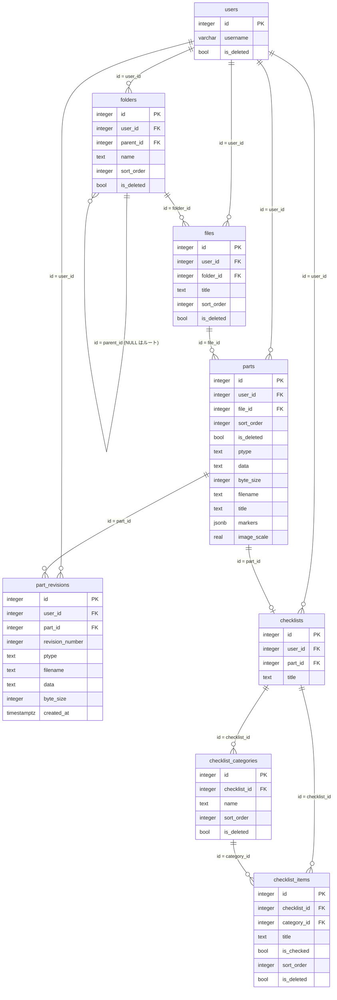

# note-management DB設計

> API のパスや画面の詳細は書かない（`api-design.md` / `ui-design.md`）。
> 機能固有テーブルはスキーマ `note_management`（snake_case）に置く。`public` に業務テーブルを増やさない。

## 概要

- スキーマ: `note_management`。フォルダ・ファイル・パーツ・過去世代・チェックリスト・カテゴリ・項目を置く。
- ユーザ、セッション、システム設定、機能マスタ、メニュー割当はスキーマ `public` を読む。複製しない。列は増やさない。表の作成は `portal` が担う。
- 所有者は `user_id`（`public.users.id`）で表す。共通のデータはない。
- フォルダ・ファイル・パーツの削除は論理削除（削除フラグ `is_deleted`）とする。チェックリストのカテゴリ・項目も削除フラグで論理削除する（復元の操作はない）。物理削除は行わない（テスト・保守を除く）。
- 移行元（`sample/note`）は、フォルダ・ファイルの論理削除を「削除番号」（同名の削除済みを区別する連番）で表す。本機能は、削除フラグに置き換え、同名の一意制約を、削除されていない行だけに掛ける（削除済み同士の同名は可）。
- 移行元の「表」に関するテーブル（`table`・`table_cell`・`table_col_width`）と、パーツの種別「表」は持たない。
- チェックリストは、移行元がパーツの本文に識別子を文字列で格納していたのを改め、パーツへの外部キー（1 対 1）で持つ。
- 画像・バイナリの中身は、移行元と同じく Base64 の文字列で `data` に持つ。展開後の大きさを `byte_size` に持ち、中身を読まずに大きさを返せるようにする。
- 移行のための専用列・専用テーブルは持たない。移行済みの判定は、既存の列（利用者・親・名前・削除状態）の一致で行う（`design.md`）。
- 移行元に無い列は持たない（`byte_size` を除く。展開後の大きさは、`data` から計算できる値）。作成日時・更新日時も持たない（過去世代の保管日時を除く）。
- ログはファイルへ出す。テーブルには置かない。
- DDL は `backend/sql/01_note_management.sql`。識別子は `integer GENERATED BY DEFAULT AS IDENTITY`。日時は `timestamptz`。DDL は何度実行しても同じ結果になる。

関連ドキュメント:

- 全体設計: `design.md`
- UI設計: `ui-design.md`
- API設計: `api-design.md`

## ER図

## テーブル設計

### note_management.folders

目的: フォルダ。`parent_id` が NULL の行がルートフォルダ。論理削除する（削除フラグ）。

| カラム | 型 | NULL | 既定 | 説明 |
|--------|-----|------|------|------|
| `id` | integer | NOT NULL | IDENTITY | PK |
| `user_id` | integer | NOT NULL | - | 所有者。`public.users.id` |
| `parent_id` | integer | NULL | - | 親フォルダ。NULL はルート直下 |
| `name` | text | NOT NULL | - | フォルダ名。前後の空白を除いた結果が空でない |
| `sort_order` | integer | NOT NULL | - | 同じ親の中の並び順（昇順） |
| `is_deleted` | boolean | NOT NULL | false | 削除フラグ。true なら削除済み |

制約:

- 主キー: `id`
- 外部キー: `user_id` → `public.users.id`（ON DELETE RESTRICT）
- 外部キー: `parent_id` → `note_management.folders.id`（NO ACTION。本機能は物理削除しない）
- 一意: `(user_id, parent_id, name)` のうち `is_deleted = false` の行だけ（部分一意。`parent_id` が NULL の行と、値のある行で、別々の部分一意インデックスにする。削除済みと同じ名前での登録、削除済み同士の同名は可）
- 一意: `(user_id, parent_id, sort_order)`（削除済みを含む。`parent_id` が NULL の行と、値のある行で、別々の一意インデックスにする）。並び順の入れ替えは、同じトランザクションの中で、一時的に未使用の値（-1）を経由して行う
- 検査: `char_length(btrim(name)) > 0`

インデックス:

| 名前 | 対象カラム | 種別 |
|------|------------|------|
| 部分一意（ルート） | `(user_id, name)` のうち `parent_id IS NULL AND is_deleted = false` | 重複判定 |
| 部分一意（子） | `(user_id, parent_id, name)` のうち `parent_id IS NOT NULL AND is_deleted = false` | 重複判定 |
| 一意（ルート） | `(user_id, sort_order)` のうち `parent_id IS NULL` | 並び順 |
| 一意（子） | `(user_id, parent_id, sort_order)` のうち `parent_id IS NOT NULL` | 並び順・直下の取得 |

### note_management.files

目的: ファイル。必ずフォルダの中に置く。論理削除する（削除フラグ）。

| カラム | 型 | NULL | 既定 | 説明 |
|--------|-----|------|------|------|
| `id` | integer | NOT NULL | IDENTITY | PK |
| `user_id` | integer | NOT NULL | - | 所有者。`public.users.id` |
| `folder_id` | integer | NOT NULL | - | 所属フォルダ。`note_management.folders.id` |
| `title` | text | NOT NULL | - | ファイルのタイトル。前後の空白を除いた結果が空でない |
| `sort_order` | integer | NOT NULL | - | 同じフォルダの中の並び順（昇順） |
| `is_deleted` | boolean | NOT NULL | false | 削除フラグ |

制約:

- 主キー: `id`
- 外部キー: `user_id` → `public.users.id`（ON DELETE RESTRICT）
- 外部キー: `folder_id` → `note_management.folders.id`（NO ACTION）
- 一意: `(user_id, folder_id, title)` のうち `is_deleted = false` の行だけ（部分一意）
- 一意: `(user_id, folder_id, sort_order)`（削除済みを含む）。並び順の入れ替えは、`folders` と同じく、一時的な値（-1）を経由する
- 検査: `char_length(btrim(title)) > 0`

インデックス: 上記の部分一意（重複判定）と一意（並び順・フォルダ直下の取得）。

### note_management.parts

目的: ファイルを構成するパーツ。論理削除する（削除フラグ）。

| カラム | 型 | NULL | 既定 | 説明 |
|--------|-----|------|------|------|
| `id` | integer | NOT NULL | IDENTITY | PK |
| `user_id` | integer | NOT NULL | - | 所有者。`public.users.id` |
| `file_id` | integer | NOT NULL | - | 所属ファイル。`note_management.files.id` |
| `sort_order` | integer | NOT NULL | - | 同じファイルの中の並び順（昇順） |
| `is_deleted` | boolean | NOT NULL | false | 削除フラグ |
| `ptype` | text | NOT NULL | - | 種別。`text` `md` `tex` `url` `action` `checklist` `jpeg` `png` `binary` のいずれか |
| `data` | text | NOT NULL | '' | 本文。テキスト・Markdown・TeX・URL の文字列、行動予定の JSON 文字列、画像・バイナリの Base64 文字列。チェックリストは空 |
| `byte_size` | integer | NOT NULL | 0 | 画像・バイナリの展開後の大きさ（バイト）。それ以外は 0 |
| `filename` | text | NOT NULL | '' | ファイル名（画像・バイナリ） |
| `title` | text | NOT NULL | '' | 表示用のタイトル（画像。任意） |
| `markers` | jsonb | NOT NULL | '[]' | 画像のマーカーの配列（`id` `kind` `x` `y` `text`、番号マーカーは `number`） |
| `image_scale` | real | NOT NULL | 1.0 | 画像の表示倍率（1.0 = 100%） |

制約:

- 主キー: `id`
- 外部キー: `user_id` → `public.users.id`（ON DELETE RESTRICT）
- 外部キー: `file_id` → `note_management.files.id`（NO ACTION）
- 一意: `(user_id, file_id, sort_order)`（削除済みを含む）。入れ替えは、一時的な値（-1）を経由する
- 検査: `ptype IN ('text','md','tex','url','action','checklist','jpeg','png','binary')`
- 検査: `ptype NOT IN ('jpeg','png','binary') OR char_length(btrim(filename)) > 0`（画像・バイナリはファイル名が必須）
- 検査: `byte_size >= 0`
- 検査: `image_scale >= 0.25 AND image_scale <= 4.0`
- 検査: `jsonb_typeof(markers) = 'array'`

インデックス: 一意制約に付随する `(user_id, file_id, sort_order)`（ファイルのパーツの取得）。

種別ごとの規則（本文の空の可否、行動予定の JSON の構造、マーカーの内容・個数、画像の形式、大きさの上限、種別ごとの列の使い分け）は、アプリケーション層で保証する（DB では上記以外を検査しない）。

### note_management.part_revisions

目的: 画像・バイナリのパーツの過去世代。差し替えの直前の内容を保管する。

| カラム | 型 | NULL | 既定 | 説明 |
|--------|-----|------|------|------|
| `id` | integer | NOT NULL | IDENTITY | PK（世代の識別子） |
| `user_id` | integer | NOT NULL | - | 所有者。`public.users.id` |
| `part_id` | integer | NOT NULL | - | 元のパーツ。`note_management.parts.id` |
| `revision_number` | integer | NOT NULL | - | パーツの中の世代番号（1 から、差し替えのたびに増える） |
| `ptype` | text | NOT NULL | - | その世代の種別。`jpeg` `png` `binary` のいずれか |
| `filename` | text | NOT NULL | - | その世代のファイル名 |
| `data` | text | NOT NULL | - | その世代の中身（Base64） |
| `byte_size` | integer | NOT NULL | 0 | その世代の展開後の大きさ（バイト） |
| `created_at` | timestamptz | NOT NULL | now() | 保管した日時 |

制約:

- 主キー: `id`
- 外部キー: `user_id` → `public.users.id`（ON DELETE RESTRICT）
- 外部キー: `part_id` → `note_management.parts.id`（ON DELETE CASCADE）
- 一意: `(part_id, revision_number)`
- 検査: `ptype IN ('jpeg','png','binary')`、`byte_size >= 0`

インデックス: 一意制約に付随する `(part_id, revision_number)`（一覧・最大の世代番号・古い世代の削除）。

### note_management.checklists

目的: チェックリストパーツのチェックリスト本体。パーツと 1 対 1。

| カラム | 型 | NULL | 既定 | 説明 |
|--------|-----|------|------|------|
| `id` | integer | NOT NULL | IDENTITY | PK |
| `user_id` | integer | NOT NULL | - | 所有者。`public.users.id` |
| `part_id` | integer | NOT NULL | - | 対応するパーツ。`note_management.parts.id` |
| `title` | text | NOT NULL | '' | タイトル（空なら表示しない） |

制約:

- 主キー: `id`
- 外部キー: `user_id` → `public.users.id`（ON DELETE RESTRICT）
- 外部キー: `part_id` → `note_management.parts.id`（ON DELETE CASCADE）
- 一意: `part_id`（1 パーツに 1 チェックリスト）

### note_management.checklist_categories

目的: チェックリストのカテゴリ。名前が空のカテゴリは無名カテゴリ。論理削除する（削除フラグ。復元はしない）。

| カラム | 型 | NULL | 既定 | 説明 |
|--------|-----|------|------|------|
| `id` | integer | NOT NULL | IDENTITY | PK |
| `checklist_id` | integer | NOT NULL | - | `note_management.checklists.id` |
| `name` | text | NOT NULL | '' | カテゴリ名。空文字は無名カテゴリ |
| `sort_order` | integer | NOT NULL | 0 | 表示順（昇順） |
| `is_deleted` | boolean | NOT NULL | false | 削除フラグ |

制約:

- 主キー: `id`
- 外部キー: `checklist_id` → `note_management.checklists.id`（ON DELETE CASCADE）
- 一意: `(checklist_id, name)` のうち `is_deleted = false` の行だけ（部分一意。無名カテゴリは、名前が空の 1 行だけになる）

インデックス: 部分一意（重複判定）、`(checklist_id, sort_order)`（並び）。

### note_management.checklist_items

目的: チェック項目。カテゴリに属する。論理削除する（削除フラグ。復元はしない）。

| カラム | 型 | NULL | 既定 | 説明 |
|--------|-----|------|------|------|
| `id` | integer | NOT NULL | IDENTITY | PK |
| `checklist_id` | integer | NOT NULL | - | `note_management.checklists.id` |
| `category_id` | integer | NOT NULL | - | `note_management.checklist_categories.id` |
| `title` | text | NOT NULL | '' | 項目のタイトル |
| `is_checked` | boolean | NOT NULL | false | チェック状態 |
| `sort_order` | integer | NOT NULL | 0 | カテゴリの中の表示順（昇順） |
| `is_deleted` | boolean | NOT NULL | false | 削除フラグ |

制約:

- 主キー: `id`
- 外部キー: `checklist_id` → `note_management.checklists.id`（ON DELETE CASCADE）
- 外部キー: `category_id` → `note_management.checklist_categories.id`（ON DELETE CASCADE）

インデックス: `(category_id, sort_order)`（カテゴリの項目の並び）、`(checklist_id)`。

項目の `checklist_id` が、カテゴリの `checklist_id` と同じであることは、別のテーブルの値を参照する規則のため、アプリケーション層で保証する。

## 関連

- `users` 1 対 多 `folders` / `files` / `parts` / `part_revisions` / `checklists`（`user_id`）。
- `folders` 1 対 多 `folders`（`parent_id`。NULL がルート）、`folders` 1 対 多 `files`。削除は物理削除でなく削除フラグ。フォルダを削除しても、子孫の行は変更しない。「祖先が削除済み」は、`parent_id` を上にたどる再帰の問い合わせで判定する。
- `files` 1 対 多 `parts`、`parts` 1 対 多 `part_revisions`、`parts` 1 対 0 または 1 `checklists`。
- `checklists` 1 対 多 `checklist_categories`、`checklist_categories` 1 対 多 `checklist_items`。

## 要件トレーサビリティ

| 要件 | 設計 |
|------|------|
| REQ-001 | テーブルなし（`public` のユーザ・機能マスタ・メニュー割当を参照） |
| REQ-002 | 全テーブルの `user_id` による絞り込み（チェックリストのカテゴリ・項目は、チェックリストの `user_id` を経由） |
| REQ-003 | `folders`・`files` の直下の取得（`sort_order` 順）、祖先をたどる削除済みの判定 |
| REQ-004 | `folders` の挿入・更新（`name`・`parent_id`・`sort_order`・`is_deleted`）、`(user_id, parent_id, name)` の部分一意、並び順の一意 |
| REQ-005 | `files` の挿入・更新、`(user_id, folder_id, title)` の部分一意、並び順の一意 |
| REQ-006 | `folders`・`files`・`parts` の `is_deleted`、並び順の一意（重なるときは末尾に付け直す）、部分一意（削除解除のときの同名の判定） |
| REQ-007 | `files`・`folders`・`parts`（`sort_order` 順）、`part_revisions`（一覧）、`checklists` 以下（チェックリストの表示） |
| REQ-008 | `parts` の挿入・更新、`ptype` の検査、`byte_size` |
| REQ-009 | `parts.title`・`markers`・`image_scale`（検査を含む） |
| REQ-010 | `part_revisions`（世代番号・保管日時・古い世代の削除） |
| REQ-011 | `parts.data`（行動予定の JSON 文字列） |
| REQ-012 | `checklists`・`checklist_categories`・`checklist_items`（部分一意、`sort_order`、`is_deleted`） |
| REQ-013 | テーブルなし（フロントの印刷用のレイアウト） |
| REQ-014 | テーブルなし（ファイルログ） |
| REQ-015 | テーブルなし（移行元・移行先の接続） |
| REQ-016 | 全テーブル。識別子は移行先で採番し、名前・タイトル・並び順・種別・本文・マーカー・倍率・世代番号・保管日時は移行元の値を格納する。移行元の削除番号は、削除フラグ（0 でなければ true）に置き換える。チェックリストの参照は、`checklists.part_id` に付け替える |
| REQ-017 | 移行済みの判定は、`folders`（`user_id`・`parent_id`・`name`・`is_deleted`）、`files`（`user_id`・`folder_id`・`title`・`is_deleted`）の一致による。整合の確認は、`parts`・`part_revisions`・`checklist_categories`・`checklist_items` の件数と、`byte_size`・`data` の照合による |
| REQ-018 | テーブルなし（実行結果は標準エラー出力） |

## 未決事項

- なし

## 承認

現在の状態: 承認済み

| 日時 | 状態 | 変更概要 |
|------|------|----------|
| 2026-09-21 22:54 | 未承認 | 初版 |
| 2026-09-21 22:55 | 承認済み | 初版を承認 |
