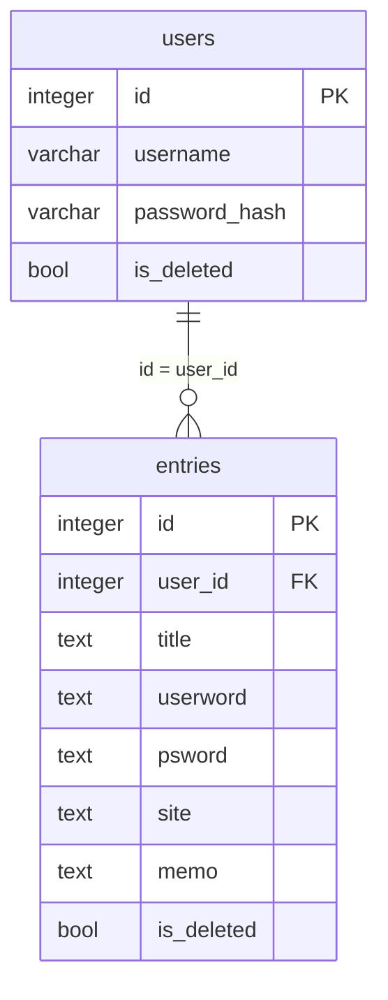

# password-management DB設計

> API のパスや画面の詳細は書かない（`api-design.md` / `ui-design.md`）。

## 概要

- スキーマ: `password_management`。パスワードエントリを置く。
- ユーザ、セッション、機能マスタ、メニュー割当はスキーマ `public` を読む。複製しない。列は増やさない。表の作成は `portal` が担う。
- ログはファイルへ出す。テーブルには置かない。

関連ドキュメント:

- 全体設計: `design.md`
- UI設計: `ui-design.md`
- API設計: `api-design.md`

## ER図

## テーブル設計

### password_management.entries

目的: 利用者本人のパスワードエントリ（タイトル・ユーザ名・パスワード・サイトURL・メモ）。論理削除する（削除フラグ）。

| カラム | 型 | NULL | 既定 | 説明 |
|--------|-----|------|------|------|
| `id` | integer | NOT NULL | シーケンス | PK |
| `user_id` | integer | NOT NULL | - | 所有者。`public.users.id` |
| `title` | text | NOT NULL | - | タイトル。空は置かない |
| `userword` | text | NOT NULL | - | ユーザ名。空は置かない |
| `psword` | text | NOT NULL | - | パスワード（複数行可）。空は置かない |
| `site` | text | NULL | - | サイトURL。任意 |
| `memo` | text | NULL | - | メモ。任意 |
| `is_deleted` | boolean | NOT NULL | false | 削除フラグ。true なら削除済み |

制約:

- 主キー: `id`
- 一意: `(user_id, title)` のうち `is_deleted = false` の行だけ（部分一意。論理削除済み同士、および削除済みと同じタイトルの未削除は可）
- 外部キー: `user_id` → `public.users.id`（ON DELETE RESTRICT）
- 検査: `char_length(title) > 0`
- 検査: `char_length(userword) > 0`
- 検査: `char_length(psword) > 0`

インデックス:

- 部分一意に付随する `(user_id, title)` のうち `is_deleted = false`（登録・更新時のタイトル重複判定、検索用）
- `(user_id)` のうち `is_deleted = false`（一覧・検索）

`title` / `userword` の「空白のみ不可」の判定はアプリ側（トリム後の空文字判定）で行い、格納値もトリム済みの値とする。DB の検査制約は空文字のみを防ぐ。`title` の重複判定・一覧・検索は、常に `user_id` が一致する行だけを対象にする。物理削除はしない。一覧・検索・単件取得は `is_deleted = false` の行だけを対象とする。

## 関連

- `users` 1 対 多 `entries`。論理削除する（削除フラグ）。

## 要件トレーサビリティ

| 要件 | 設計 |
|------|------|
| REQ-001 | テーブルなし（`public` のユーザ・機能マスタ・メニュー割当を参照） |
| REQ-002 | `entries.user_id` による絞り込み |
| REQ-003 | `entries` への挿入。`(user_id, title)` の部分一意でタイトル重複を判定 |
| REQ-004 | `entries` の更新。`(user_id, title)` の部分一意で重複判定（自エントリは対象外） |
| REQ-005 | `entries` の論理削除（`is_deleted`） |
| REQ-006 | `entries` の一覧・検索（`is_deleted = false`、`title`/`userword`/`site`/`memo` の部分一致） |
| REQ-007 | `entries` の単件取得（`is_deleted = false`） |
| REQ-008 | テーブルなし（ファイルログ） |

## 未決事項

- なし

## 承認

現在の状態: 承認済み

| 日時 | 状態 | 変更概要 |
|------|------|----------|
| 2026-09-20 01:14 | 未承認 | 初版 |
| 2026-09-20 01:15 | 承認済み | 初版を承認 |
