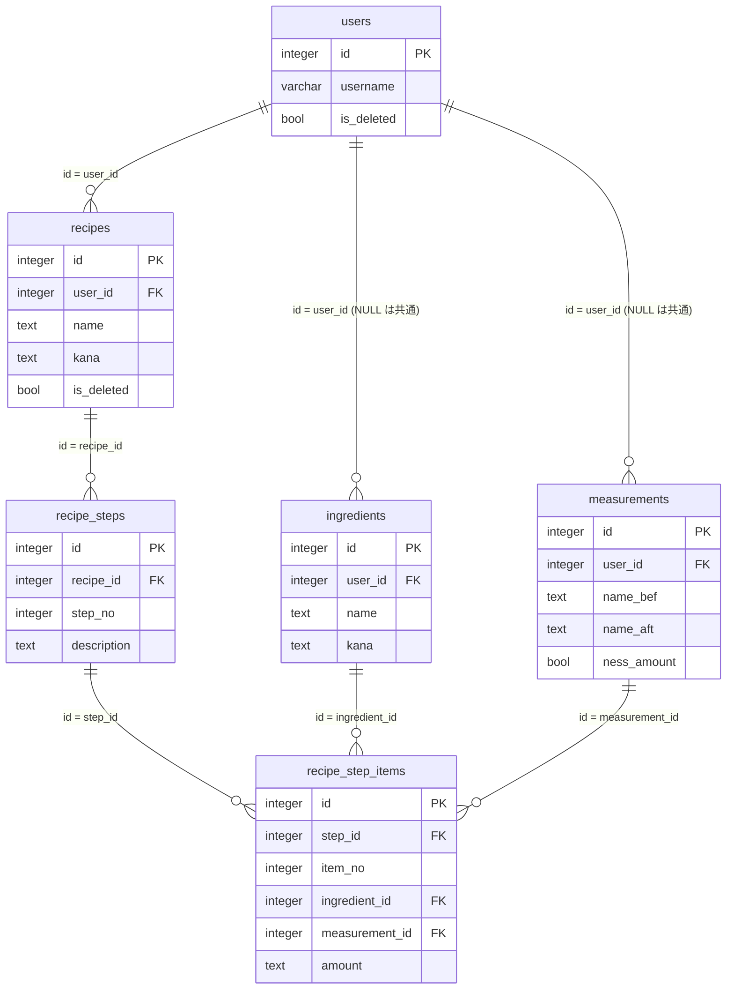

# recipe-management DB設計

> API のパスや画面の詳細は書かない（`api-design.md` / `ui-design.md`）。
> 機能固有テーブルはスキーマ `recipe_management`（snake_case）に置く。`public` に業務テーブルを増やさない。

## 概要

- スキーマ: `recipe_management`。レシピ・工程・工程の材料・材料・分量名称を置く。
- ユーザ、セッション、システム設定、機能マスタ、メニュー割当はスキーマ `public` を読む。複製しない。列は増やさない。表の作成は `portal` が担う。
- 所有者は `user_id`（`public.users.id`）で表す。材料・分量名称は、`user_id` が NULL のものが全利用者共通、値のあるものが利用者独自である。
- レシピの削除は論理削除（削除フラグ）とする。工程・工程の材料は、レシピの編集で作り直すため、物理削除する（レシピの物理削除と、工程・工程の材料の連鎖削除は、参照制約で行う）。
- 移行のための専用列・専用テーブルは持たない。移行済みの判定は、既存の列（利用者・メニュー名）の一致で行う（`design.md`）。
- 移行元（`sample/recipe`）に無い列として、`recipes` に作成日時・更新日時、`recipe_step_items` に並び（`item_no`）を持つ。移行元の並びは、工程の材料の識別子の順である。
- ログはファイルへ出す。テーブルには置かない。
- DDL は `backend/sql/01_recipe_management.sql`。識別子は `integer GENERATED BY DEFAULT AS IDENTITY`。日時は `timestamptz`。

関連ドキュメント:

- 全体設計: `design.md`
- UI設計: `ui-design.md`
- API設計: `api-design.md`

## ER図

## テーブル設計

### recipe_management.ingredients

目的: 材料。`user_id` が NULL の行は全利用者共通の材料、値のある行は利用者独自の材料。

| カラム | 型 | NULL | 既定 | 説明 |
|--------|-----|------|------|------|
| `id` | integer | NOT NULL | IDENTITY | PK |
| `user_id` | integer | NULL | - | 所有者。`public.users.id`。NULL は共通の材料 |
| `name` | text | NOT NULL | - | 材料名。前後の空白を除いた結果が空でない |
| `kana` | text | NOT NULL | - | 材料のかな。前後の空白を除いた結果が空でない |
| `created_at` | timestamptz | NOT NULL | now() | 作成日時 |

制約:

- 主キー: `id`
- 一意: 共通の材料は `(name)`（`user_id IS NULL` の行だけ）。独自の材料は `(user_id, name)`（`user_id IS NOT NULL` の行だけ）。いずれも部分一意（NULL は通常の一意制約では重複できるため、部分一意に分ける）。共通と独自の間で同じ名前を許さない規則（REQ-008）は、アプリケーション層で確認する。
- 外部キー: `user_id` → `public.users.id`（ON DELETE RESTRICT）
- 検査: `char_length(btrim(name)) > 0`、`char_length(btrim(kana)) > 0`

インデックス:

| 名前 | 対象カラム | 種別 |
|------|------------|------|
| 部分一意 2 件 | 上記 | 重複判定 |
| `ingredients_kana_idx` | `(kana, id)` | 一覧の並び |

初期データ（共通の材料。`user_id` は NULL）:

| name | kana |
|------|------|
| 砂糖 | さとう |
| 塩 | しお |
| 胡椒 | こしょう |
| 醤油 | しょうゆ |
| みりん | みりん |
| 酒 | さけ |
| 味噌 | みそ |
| サラダ油 | さらだあぶら |
| 卵 | たまご |
| 牛乳 | ぎゅうにゅう |
| バター | ばたー |
| 豆板醤 | とうばんじゃん |

### recipe_management.measurements

目的: 分量名称（接頭語・接尾語・数量の要否）。`user_id` が NULL の行は共通、値のある行は利用者独自。

| カラム | 型 | NULL | 既定 | 説明 |
|--------|-----|------|------|------|
| `id` | integer | NOT NULL | IDENTITY | PK |
| `user_id` | integer | NULL | - | 所有者。`public.users.id`。NULL は共通の分量名称 |
| `name_bef` | text | NOT NULL | '' | 接頭語（例: 「大さじ」）。空を許す |
| `name_aft` | text | NOT NULL | '' | 接尾語（例: 「cc」）。空を許す |
| `ness_amount` | boolean | NOT NULL | - | 数量が必要か |
| `created_at` | timestamptz | NOT NULL | now() | 作成日時 |

制約:

- 主キー: `id`
- 一意: 共通は `(name_bef, name_aft)`（`user_id IS NULL` の行だけ）。独自は `(user_id, name_bef, name_aft)`（`user_id IS NOT NULL` の行だけ）。部分一意。共通と独自の間で同じ組を許さない規則（REQ-009）は、アプリケーション層で確認する。
- 外部キー: `user_id` → `public.users.id`（ON DELETE RESTRICT）
- 検査: `name_bef <> '' OR name_aft <> ''`（接頭語・接尾語の両方が空は置かない）

インデックス:

| 名前 | 対象カラム | 種別 |
|------|------------|------|
| 部分一意 2 件 | 上記 | 重複判定 |
| `measurements_order_idx` | `(name_bef, name_aft, id)` | 一覧の並び |

初期データ（共通の分量名称。`user_id` は NULL）:

| name_bef | name_aft | ness_amount |
|----------|----------|-------------|
| 小さじ | （空） | true |
| 大さじ | （空） | true |
| （空） | cc | true |
| ひとつまみ | （空） | false |

### recipe_management.recipes

目的: 利用者本人のレシピ（サンプルの「メニュー」）。論理削除する（削除フラグ）。

| カラム | 型 | NULL | 既定 | 説明 |
|--------|-----|------|------|------|
| `id` | integer | NOT NULL | IDENTITY | PK |
| `user_id` | integer | NOT NULL | - | 所有者。`public.users.id` |
| `name` | text | NOT NULL | - | メニュー名。前後の空白を除いた結果が空でない |
| `kana` | text | NOT NULL | - | メニューのかな。前後の空白を除いた結果が空でない |
| `is_deleted` | boolean | NOT NULL | false | 削除フラグ。true なら削除済み |
| `created_at` | timestamptz | NOT NULL | now() | 作成日時 |
| `updated_at` | timestamptz | NOT NULL | now() | 更新日時 |

制約:

- 主キー: `id`
- 一意: `(user_id, name)` のうち `is_deleted = false` の行だけ（部分一意。削除済みのレシピと同じ名前での登録、削除済み同士の同名は可）
- 外部キー: `user_id` → `public.users.id`（ON DELETE RESTRICT）
- 検査: `char_length(btrim(name)) > 0`、`char_length(btrim(kana)) > 0`

インデックス:

| 名前 | 対象カラム | 種別 |
|------|------------|------|
| 部分一意 | 上記 | 重複判定（登録・更新） |
| `recipes_user_kana_idx` | `(user_id, kana, id)` のうち `is_deleted = false` | 一覧の並び |

### recipe_management.recipe_steps

目的: レシピの工程（手順）1 つ。

| カラム | 型 | NULL | 既定 | 説明 |
|--------|-----|------|------|------|
| `id` | integer | NOT NULL | IDENTITY | PK |
| `recipe_id` | integer | NOT NULL | - | `recipe_management.recipes.id` |
| `step_no` | integer | NOT NULL | - | 工程番号（1 から連番） |
| `description` | text | NOT NULL | - | 工程の説明。前後の空白を除いた結果が空でない |

制約:

- 主キー: `id`
- 一意: `(recipe_id, step_no)`
- 外部キー: `recipe_id` → `recipe_management.recipes.id`（ON DELETE CASCADE）
- 検査: `step_no >= 1`、`char_length(btrim(description)) > 0`

インデックス: 一意制約に付随する `(recipe_id, step_no)`（詳細の並び）。

### recipe_management.recipe_step_items

目的: 工程で使う材料の行（材料・分量名称・数量）。

| カラム | 型 | NULL | 既定 | 説明 |
|--------|-----|------|------|------|
| `id` | integer | NOT NULL | IDENTITY | PK |
| `step_id` | integer | NOT NULL | - | `recipe_management.recipe_steps.id` |
| `item_no` | integer | NOT NULL | - | 工程内の並び（1 から連番） |
| `ingredient_id` | integer | NOT NULL | - | `recipe_management.ingredients.id` |
| `measurement_id` | integer | NOT NULL | - | `recipe_management.measurements.id` |
| `amount` | text | NOT NULL | '' | 数量（文字列）。数量なしの分量名称では空 |

制約:

- 主キー: `id`
- 一意: `(step_id, item_no)`
- 外部キー: `step_id` → `recipe_management.recipe_steps.id`（ON DELETE CASCADE）
- 外部キー: `ingredient_id` → `recipe_management.ingredients.id`（ON DELETE RESTRICT。本機能は材料を削除しない）
- 外部キー: `measurement_id` → `recipe_management.measurements.id`（ON DELETE RESTRICT。同様）
- 検査: `item_no >= 1`

インデックス:

| 名前 | 対象カラム | 種別 |
|------|------------|------|
| 一意制約に付随 | `(step_id, item_no)` | 工程の材料の並び |
| `recipe_step_items_ingredient_idx` | `(ingredient_id)` | 参照制約の確認 |
| `recipe_step_items_measurement_idx` | `(measurement_id)` | 参照制約の確認 |

数量が必要な分量名称のときに `amount` が空でないこと、および、材料・分量名称が、共通、またはレシピの所有者の独自であることは、別のテーブルの値を参照する規則のため、アプリケーション層で保証する（DB では検査しない）。

## 関連

- `users` 1 対 多 `recipes`。
- `users` 1 対 多 `ingredients` / `measurements`（`user_id`。NULL は共通で、どの利用者にも属さない）。
- `recipes` 1 対 多 `recipe_steps` 1 対 多 `recipe_step_items`。レシピの編集は、工程と工程の材料を削除して作り直す（物理削除）。
- `ingredients` 1 対 多 `recipe_step_items`、`measurements` 1 対 多 `recipe_step_items`。

## 要件トレーサビリティ

| 要件 | 設計 |
|------|------|
| REQ-001 | テーブルなし（`public` のユーザ・機能マスタ・メニュー割当を参照） |
| REQ-002 | `recipes.user_id` による絞り込み。`ingredients` / `measurements` は `user_id` が NULL（共通）または本人 |
| REQ-003 | `recipes` の一覧（`recipes_user_kana_idx`、`is_deleted = false`） |
| REQ-004 | `recipes` の単件取得、`recipe_steps`（`step_no` 順）、`recipe_step_items`（`item_no` 順）、`ingredients`・`measurements` の結合 |
| REQ-005 | `recipes`・`recipe_steps`・`recipe_step_items` への挿入。`(user_id, name)` の部分一意で重複判定 |
| REQ-006 | `recipes` の更新、`recipe_steps` の削除と再挿入（`recipe_step_items` は連鎖削除）。部分一意で重複判定（自身除外） |
| REQ-007 | `recipes.is_deleted` の更新（論理削除）。部分一意により、同じ名前での再登録が可能 |
| REQ-008 | `ingredients`（共通・独自、部分一意、初期データ） |
| REQ-009 | `measurements`（共通・独自、部分一意、両方が空でない検査、初期データ） |
| REQ-010 | テーブルなし（ファイルログ） |
| REQ-011 | テーブルなし（移行元・移行先の接続） |
| REQ-012 | 全テーブル。識別子は移行先で採番し、工程番号・並び・数量・説明は移行元の値を格納する。材料・分量名称は、共通、指定した利用者の独自の順に対応付ける |
| REQ-013 | 移行済みの判定は、`recipes`（`user_id`・`name`・`is_deleted = false`）の一致による。整合の確認は、`recipe_steps` の件数と `recipe_step_items` の件数を、移行元と照合する |
| REQ-014 | テーブルなし（実行結果は標準エラー出力） |

## 未決事項

- なし

## 承認

現在の状態: 承認済み

| 日時 | 状態 | 変更概要 |
|------|------|----------|
| 2026-09-21 21:18 | 未承認 | 初版 |
| 2026-09-21 21:19 | 承認済み | 初版を承認 |
