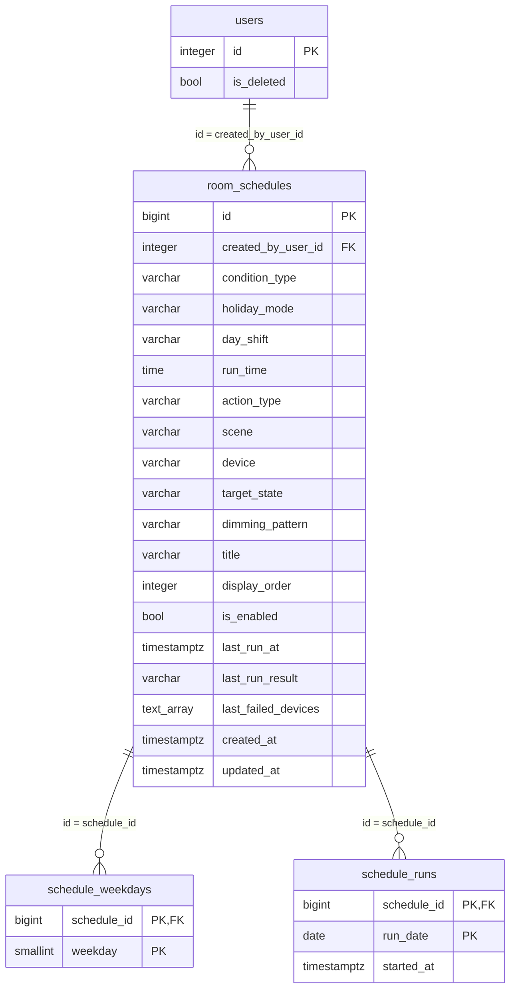

# DB設計: room（ROOM）

## 概要

この機能が使うスキーマとテーブルの範囲。`requirements.md` の該当 REQ を満たすことだけを書く。

- スキーマ: `room`。定期実行の定義と実行の記録だけを置く。
- 機器の状態（ON / OFF、施錠中 / 開錠中、電池残量、取得日時）は DB に持たない。要求のたびに SwitchBot から取得する（REQ-012）。履歴も持たない（要件のスコープ外）。
- SwitchBot の認証情報と機器の識別子は `.env` に置き、DB に持たない（REQ-012）。
- ユーザ、セッション、システム設定、機能マスタ、メニュー割当、API キーはスキーマ `public` を直接読む。複製しない。列は増やさない。表の作成は `portal`、`api-key-management` が担う。
- `room` のスキーマと表の DDL は、本機能の `backend/sql/` が持つ。`public` の表（`portal` の DDL）を先に適用しておく。
- ログはファイルへ出す。テーブルには置かない。

関連ドキュメント:

- 全体設計: `design.md`
- UI設計: `ui-design.md`
- API設計: `api-design.md`

## ER図

mermaid の erDiagram は `boolean` を型として書くとパースが壊れる。図の中だけ `bool` と書く。配列型は `text_array` と書く。実体の型はテーブル設計どおり `boolean`、`text[]` である。

## テーブル設計

### room.room_schedules

目的: 定期実行の定義。1 件につき 1 行。実行条件（曜日の指定のときは、祝日の扱いと実行日の取り方）、時刻、実行内容（一括切替、または機器 1 つの個別切替）、有効／無効、最終実行の結果を持つ。1 つの部屋に対するものなので、利用者ごとには分けない（`design.md` の認証 / 認可）。作成した利用者を残す。

| カラム | 型 | NULL | 既定 | 説明 |
|--------|-----|------|------|------|
| `id` | bigint | NOT NULL | IDENTITY | 定期実行の識別子。PK |
| `created_by_user_id` | integer | NOT NULL | - | 作成した利用者。`public.users.id` |
| `condition_type` | varchar(16) | NOT NULL | - | 実行条件。`daily`（毎日）、`weekdays`（曜日の指定） |
| `holiday_mode` | varchar(8) | NOT NULL | `'none'` | 祝日の扱い（曜日の指定のとき）。`none`（指定した曜日のみ）、`include`（祝日も実行）、`exclude`（祝日は実行しない）。毎日のときは `none` |
| `day_shift` | varchar(8) | NOT NULL | `'same'` | 実行日の取り方（曜日の指定のとき）。`same`（当日）、`before`（の前の日）、`after`（の次の日）。毎日のときは `same` |
| `run_time` | time | NOT NULL | - | 実行する時刻（日本標準時の時と分。秒は常に 0） |
| `action_type` | varchar(8) | NOT NULL | `'scene'` | 実行内容の種類。`scene`（一括切替）、`device`（機器 1 つの個別切替） |
| `scene` | varchar(32) | NULL | - | 実行する一括切替（`action_type` が `scene` のとき。`device` のときは NULL）。`indoor_speaker`（屋内スピーカー選択）、`bedside_speaker`（枕元スピーカー選択）、`ceiling_light`（電灯選択）、`indirect_light`（間接照明選択）、`out`（お出かけ） |
| `device` | varchar(16) | NULL | - | 個別切替の機器（`action_type` が `device` のとき。`scene` のときは NULL）。`ceiling_light`、`indirect_light`、`indoor_speaker`、`bedside_speaker` |
| `target_state` | varchar(3) | NULL | - | 個別切替の目標の状態（`action_type` が `device` のとき。`scene` のときは NULL）。`on`、`off` |
| `dimming_pattern` | varchar(16) | NULL | - | 電灯を ON にする個別切替の調光パターン（`action_type` が `device`、`device` が `ceiling_light`、`target_state` が `on` のときだけ）。`full`（全灯）、`reading`（読書）、`relax`（くつろぎ）、`night`（夜）。NULL は、既定のパターン（全灯）。それ以外の定期実行は NULL。明るさと色温度の値は持たない（コードの定数。`design.md`） |
| `title` | varchar(50) | NULL | - | 定期実行のタイトル（利用者が付ける名前）。付けていないときは NULL。空文字は持たない（空の入力は NULL にする）。前後に空白を持たない。画面の一覧に表示する。定期実行の判定と実行には関わらない |
| `display_order` | integer | NULL | - | 画面の一覧に並べる順を決める数（0 以上 9999 以下）。小さい数が先に並び、NULL は末尾に並ぶ。付けていないときは NULL。定期実行の判定と実行には関わらない |
| `is_enabled` | boolean | NOT NULL | true | 有効なら true |
| `last_run_at` | timestamptz | NULL | - | 最後に実行した日時。未実行は NULL |
| `last_run_result` | varchar(16) | NULL | - | 最後の実行の結果。`success`（成功）、`partial`（一部失敗）、`failure`（失敗）。未実行は NULL |
| `last_failed_devices` | text[] | NOT NULL | `'{}'` | 最後の実行で失敗した機器の名称（`ceiling_light`、`indirect_light`、`indoor_speaker`、`bedside_speaker`）。成功・未実行は空配列 |
| `created_at` | timestamptz | NOT NULL | 現在時刻 | 作成日時 |
| `updated_at` | timestamptz | NOT NULL | 現在時刻 | 更新日時 |

制約:

- 主キー: `id`
- 一意: なし
- 外部キー: `created_by_user_id` → `public.users.id`（ON DELETE RESTRICT。ユーザは物理削除しない）
- CHECK: `condition_type IN ('daily', 'weekdays')`
- CHECK: `holiday_mode IN ('none', 'include', 'exclude')`
- CHECK: `day_shift IN ('same', 'before', 'after')`
- CHECK: `condition_type = 'weekdays' OR (holiday_mode = 'none' AND day_shift = 'same')`（毎日のときは、祝日の扱いと実行日の取り方を付けない）
- CHECK: `action_type IN ('scene', 'device')`
- CHECK: `scene IN ('indoor_speaker', 'bedside_speaker', 'ceiling_light', 'indirect_light', 'out')`（NULL を許す）
- CHECK: `device IN ('ceiling_light', 'indirect_light', 'indoor_speaker', 'bedside_speaker')`（NULL を許す。玄関ドアは含めない）
- CHECK: `target_state IN ('on', 'off')`（NULL を許す）
- CHECK: `(action_type = 'scene' AND scene IS NOT NULL AND device IS NULL AND target_state IS NULL) OR (action_type = 'device' AND scene IS NULL AND device IS NOT NULL AND target_state IS NOT NULL)`（実行内容の種類に応じた列だけが入る）
- CHECK: `dimming_pattern IN ('full', 'reading', 'relax', 'night')`（NULL を許す）
- CHECK: `dimming_pattern IS NULL OR (action_type = 'device' AND device = 'ceiling_light' AND target_state = 'on')`（調光パターンは、電灯を ON にする個別切替のときだけ）
- CHECK: `title IS NULL OR (char_length(title) BETWEEN 1 AND 50 AND title = btrim(title))`（タイトルは、あれば 1〜50 文字で、前後に空白を持たない）
- CHECK: `display_order IS NULL OR display_order BETWEEN 0 AND 9999`
- CHECK: `last_run_result IN ('success', 'partial', 'failure')`（NULL を許す）
- CHECK: `(last_run_at IS NULL) = (last_run_result IS NULL)`（最終実行の日時と結果は一緒に入る）
- CHECK: `last_failed_devices <@ ARRAY['ceiling_light', 'indirect_light', 'indoor_speaker', 'bedside_speaker']::text[]`
- CHECK: `date_part('second', run_time) = 0`（時と分の指定）

インデックス:

| 名前 | 対象カラム | 種別 |
|------|------------|------|
| `ix_room_schedules_enabled` | `is_enabled` | 通常（ジョブが有効なものを選ぶ） |
| `ix_room_schedules_run_time` | `run_time`, `scene` | 通常（時刻順の参照） |
| `ix_room_schedules_display_order` | `display_order`, `run_time`, `id` | 通常（一覧の並び順。`ORDER BY display_order ASC NULLS LAST, run_time, id`。PostgreSQL の昇順は、NULL を末尾に置く） |

補足:

- `last_failed_devices` は、画面に表示するだけで検索・結合に使わない。機器は 4 つで固定のため、配列で持つ（非正規形を許容する）。値の集合は CHECK で縛る。
- 玄関ドアは、一括切替・個別切替の定期実行の対象に含まれないため、失敗した機器の値に含めない（REQ-007、REQ-008）。
- 調光パターンの種類（`full`、`reading`、`relax`、`night`）は、`design.md` の `app/dimming.py` の定数と一致させる。種類を増やす・値を変えるときは、要件・設計の改訂と、本表の CHECK の付け替えを伴う。一括切替（`scene`）の定期実行は、調光パターンを持たず、電灯選択は既定のパターンで点灯する。
- 機器の個別切替の定期実行が失敗したとき、`last_failed_devices` は、その機器 1 つになる。結果は `success` か `failure` のみ（`partial` は一括切替のとき）。
- 実行内容の種類ごとに入る列が異なる。列を、種類ごとの別表に分けず、1 表に NULL 許容で持つのは、定期実行 1 件が持つ実行内容が 1 つで、列が少ないため。整合は CHECK で保つ。
- 祝日・曜日の判定に使う日付は、表には持たない。ユーザ休日は、`public.user_holidays`（`schedule` 機能が登録）を、ジョブが読み取りだけで参照する（本機能の表は増やさない。列は `user_id`・`holiday_date`・`is_deleted`）。判定は、ジョブが、実行時に、`holiday_mode`・`day_shift`・曜日（`schedule_weekdays`）から行う（`design.md` の基準日の判定）。
- 定期実行の削除は物理削除とする。他の表から参照されない（`schedule_weekdays` と `schedule_runs` は、削除に連動して消える）。

本機能の扱い:

- 画面・API の操作で、追加・更新・削除・有効／無効の切替をする。
- ジョブが、有効なものを全件読み、実行後に `last_run_at`、`last_run_result`、`last_failed_devices` を更新する。
- 定義の更新（実行条件・祝日の扱い・実行日の取り方・時刻・実行内容・調光パターン・有効／無効）では、最終実行の列は変えない。
- タイトルと表示順は、定義の更新で、サービスが「要求に項目があるときだけ」書き換える（`design.md` の「タイトルと表示順の更新の規則」。項目が無ければ現在の値のまま、`null` なら外す）。DB の列は、付けていない状態を NULL で表す。
- 一覧の並びは、`display_order` の昇順（NULL は末尾）、同じ値の中は `run_time`、`id` の昇順とする（要件は、同じ値の中の並びを問わないが、決まった並びにするため）。

### room.schedule_weekdays

目的: 実行条件が `weekdays`（曜日の指定）の定期実行が、どの曜日に実行されるか。1 曜日につき 1 行。

| カラム | 型 | NULL | 既定 | 説明 |
|--------|-----|------|------|------|
| `schedule_id` | bigint | NOT NULL | - | 定期実行。`room.room_schedules.id` |
| `weekday` | smallint | NOT NULL | - | 曜日。1 = 月曜、2 = 火曜、…、7 = 日曜（ISO 8601） |

制約:

- 主キー: `(schedule_id, weekday)`
- 一意: 主キーに同じ
- 外部キー: `schedule_id` → `room.room_schedules.id`（ON DELETE CASCADE）
- CHECK: `weekday BETWEEN 1 AND 7`

インデックス:

- 主キーに付随

補足:

- `condition_type = 'weekdays'` のときは 1 件以上、それ以外のときは 0 件とする。この整合は、サービスが保存の前に検証する（DB の制約では表現しない）。
- 更新では、現在の行を置き換える。

本機能の扱い: 定期実行の登録・更新で、曜日の行を置き換える。ジョブが、判定日の曜日（ISO 8601）と照合する。

### room.schedule_runs

目的: 定期実行を、ある日に実行したことの記録。同じ定期実行を同じ日に重ねて実行しないための印である（REQ-009）。

| カラム | 型 | NULL | 既定 | 説明 |
|--------|-----|------|------|------|
| `schedule_id` | bigint | NOT NULL | - | 定期実行。`room.room_schedules.id` |
| `run_date` | date | NOT NULL | - | 実行した日（日本標準時の暦日） |
| `started_at` | timestamptz | NOT NULL | 現在時刻 | 実行を始めた日時 |

制約:

- 主キー: `(schedule_id, run_date)`
- 一意: 主キーに同じ
- 外部キー: `schedule_id` → `room.room_schedules.id`（ON DELETE CASCADE）

インデックス:

- 主キーに付随

補足:

- 行の追加は、`INSERT ... ON CONFLICT DO NOTHING` とし、1 行追加できたジョブだけが当該定期実行を実行する。2 つのジョブが同時に動いても、実行は 1 回だけになる。
- 実行の直前に追加する。実行が失敗しても行は残し、同じ日には再実行しない（再試行しない。誤った二重の指示を避ける）。
- 結果（成功・一部失敗・失敗）と失敗した機器は、`room_schedules` の最終実行の列に残す。本表は結果を持たない。
- 行は 1 定期実行につき 1 日 1 行で、小さい。削除は、定期実行の削除に連動する場合に限る。

本機能の扱い: ジョブが、実行の直前に 1 行追加する。参照して、同じ日に実行済みかを判定する。更新しない。

### public.users（参照のみ）

目的: ログインに使うユーザ。本機能は読取のみ（追加・更新・論理削除はしない）。定義の正は `portal` / `user-management` の DB 設計である。

| カラム | 型 | NULL | 既定 | 説明 |
|--------|-----|------|------|------|
| `id` | integer | NOT NULL | シーケンス | ユーザID。PK。`created_by_user_id` |
| `username` | varchar(255) | NOT NULL | - | ユーザ名 |
| `password_hash` | varchar(255) | NOT NULL | - | パスワードのハッシュ。本機能は使わない |
| `is_deleted` | boolean | NOT NULL | false | 論理削除なら true |

本機能の扱い: セッションまたは API キーから特定したユーザが `is_deleted = false` のときだけ許可する。`password_hash` は読まない。列は増やさない。

### public.sessions（参照のみ）

目的: ログイン状態。本機能は参照のみ（作成・ログアウトはしない）。

| カラム | 型 | NULL | 既定 | 説明 |
|--------|-----|------|------|------|
| `id` | uuid | NOT NULL | 生成した UUID | セッション ID。PK。Cookie の値 |
| `user_id` | integer | NOT NULL | - | 対象ユーザ。`users.id` |
| `expires_at` | timestamptz | NOT NULL | - | この日時を過ぎたら未ログイン |

本機能の扱い: 行が無い、期限切れ、対象ユーザが論理削除済みは未ログイン。利用のたびに `expires_at` を延ばしてよい。期限は `SESSION_TIMEOUT_MINUTES` から算出する。セッションの新規作成と破棄はしない。

### public.system_settings（参照のみ）

目的: 機能をまたいで参照する値。本機能は読むだけ（変更しない）。

| カラム | 型 | NULL | 既定 | 説明 |
|--------|-----|------|------|------|
| `key` | varchar(64) | NOT NULL | - | 設定キー。PK |
| `value_text` | text | NULL | - | URL など文字列の値 |
| `value_bytes` | bytea | NULL | - | アイコンのバイナリ |
| `value_media_type` | varchar(64) | NULL | - | バイナリのメディアタイプ |

本機能が読むキー:

| key | 使う列 | 用途 |
|-----|--------|------|
| `login_url` | `value_text` | 未ログイン時の誘導先 |
| `menu_url` | `value_text` | 戻る先 |
| `icon_system` | `value_bytes` + `value_media_type` | ヘッダのシステムアイコン |
| `icon_back` | `value_bytes` + `value_media_type` | ヘッダの戻るアイコン |

### public.features（参照のみ）

目的: 機能マスタ。本機能は識別子 `room` の行を読んで利用可否を判定する。更新しない。

| カラム | 型 | NULL | 既定 | 説明 |
|--------|-----|------|------|------|
| `id` | varchar(64) | NOT NULL | - | 機能ID。PK |
| `title` | varchar(255) | NOT NULL | - | タイトル |
| `url` | varchar(2048) | NOT NULL | - | 遷移先 URL |
| `icon` | bytea | NOT NULL | - | アイコン |
| `icon_media_type` | varchar(64) | NOT NULL | - | メディアタイプ |
| `is_deleted` | boolean | NOT NULL | false | 論理削除なら true |

本機能の扱い: `id = 'room'` かつ `is_deleted = false` のときだけ利用を許可する。`room` の行の登録は、本機能の DDL では行わない（`tasks.md` で扱う。`design.md` の未決事項）。

### public.menu_assignments（参照のみ）

目的: ユーザのメニューに載せる機能。本機能は、操作中ユーザに `room` が割り当てられているかの判定に使う。更新しない。

| カラム | 型 | NULL | 既定 | 説明 |
|--------|-----|------|------|------|
| `user_id` | integer | NOT NULL | - | 対象ユーザ。`users.id` |
| `feature_id` | varchar(64) | NOT NULL | - | 対象機能。`features.id` |
| `display_order` | integer | NOT NULL | - | 表示順 |

本機能の扱い: `user_id` が操作中ユーザ、`feature_id = 'room'`、かつユーザと機能が未削除のときだけ許可する。

### public.api_keys（参照のみ）

目的: 他システム連携用の API キー。本機能は API キーによる認証のために読み、許可したときに `last_used_at` だけを更新する。発行・失効・削除はしない。列と制約は `specs/api-key-management/db-design.md` のとおり（表の作成は `api-key-management`）。

| カラム | 型 | NULL | 既定 | 説明 |
|--------|-----|------|------|------|
| `id` | bigint | NOT NULL | IDENTITY | API キーの識別子。PK |
| `user_id` | integer | NOT NULL | - | 持ち主。`users.id` |
| `key_hash` | char(64) | NOT NULL | - | キー全体の SHA-256（16 進小文字）。一意 |
| `key_prefix` | varchar(12) | NOT NULL | - | 識別用の先頭部分（ログに使う） |
| `expires_at` | timestamptz | NULL | - | 有効期限。NULL は無期限 |
| `last_used_at` | timestamptz | NULL | - | 最終利用日時。本機能が更新する |
| `revoked_at` | timestamptz | NULL | - | 失効日時。NULL は未失効 |

本機能が使う列だけを示す（`name`、`created_at` も存在する）。

本機能の扱い: `Authorization` ヘッダのキーの SHA-256 で `key_hash` を検索する。行が無い、`revoked_at` がある、`expires_at` を過ぎている、持ち主が論理削除済みは未ログイン。その後の割当判定は Cookie と同じ（`public.features`・`public.menu_assignments`）。許可したときだけ `last_used_at = now()` に更新する。

## 既存の DB の移行

すでに `room.room_schedules` がある DB へ、列を足し、制約を直す。DDL の `sql/02_room_actions.sql` が行う。`sql/apply.py` が `sql/*.sql` を番号順に適用する。**繰り返し適用しても壊れない**（列は `ADD COLUMN IF NOT EXISTS`、制約は付け替え、変換は 1 回目だけ効く）。

| 手順 | 内容 |
|------|------|
| 1 | `holiday_mode`、`day_shift`、`action_type`、`device`、`target_state` を、`ADD COLUMN IF NOT EXISTS` で足す（既定: `'none'`、`'same'`、`'scene'`、NULL、NULL）。既存の行は、すべて「一括切替、当日、祝日は関係しない」になる |
| 2 | `scene` の `NOT NULL` を外す |
| 3 | 実行条件が `holiday`（従来の祝日の指定）の行を、**無効**にし、`condition_type` を `weekdays` に変え、`schedule_weekdays` に月曜から日曜の全曜日を入れる。祝日の扱いは `none`。内容（曜日と祝日の扱い）を、利用者が見直して、有効にする（REQ-008） |
| 4 | 実行条件の CHECK を `('daily', 'weekdays')` に付け替える。新しい列の CHECK と、整合の CHECK を足す |
| 5 | 最終実行の列、`schedule_weekdays`、`schedule_runs` は、変えない |

**電灯の調光の追加（2026-10-06 の改訂）**: `sql/03_room_dimming.sql` が、`dimming_pattern` を `ADD COLUMN IF NOT EXISTS` で足し（既存の行はすべて NULL = 既定のパターン）、列の CHECK と、整合の CHECK を付け替える。繰り返し適用しても壊れない。既存のデータは、変換しない。

| 手順 | 内容 |
|------|------|
| 1 | `dimming_pattern` を、`ADD COLUMN IF NOT EXISTS`（NULL）で足す |
| 2 | 列の CHECK（種類）と、整合の CHECK（電灯を ON にする個別切替のときだけ）を、付け替える |
| 3 | 既存の行は変えない |

**定期実行のタイトルと表示順の追加（2026-10-06 の改訂）**: `sql/04_room_schedule_title_order.sql` が、`title` と `display_order` を `ADD COLUMN IF NOT EXISTS`（NULL）で足し、列の CHECK と、並びのインデックスを付ける。繰り返し適用しても壊れない。既存の行は、すべて NULL（タイトル無し、表示順なし）になり、変換しない。

| 手順 | 内容 |
|------|------|
| 1 | `title`（varchar(50)）と `display_order`（integer）を、`ADD COLUMN IF NOT EXISTS`（NULL）で足す |
| 2 | 列の CHECK（`title`、`display_order`）を、付け替える（`DROP CONSTRAINT IF EXISTS` のあと `ADD CONSTRAINT`） |
| 3 | インデックス `ix_room_schedules_display_order` を、`CREATE INDEX IF NOT EXISTS` で作る |
| 4 | 既存の行は変えない（並びは、すべて表示順なしの扱いになり、時刻の昇順になる） |

電灯は、これまで未実装で、実行しても何も起きなかった。この改訂のあとは、既存の定期実行のうち、電灯に関わるもの（電灯の個別切替、電灯選択、お出かけ）も、実際に電灯を操作する。電灯を ON にする既存の個別切替は、既定のパターン（全灯）で点灯する。データの変換や無効化はしない。

手順 3（従来の祝日の指定）の変換は、意味が変わる（祝日だけに実行していたものが、全曜日の定義になる）ため、**必ず無効にして**残す。変換後の行は、利用者が確認するまで、実行されない。

## 関連

- `users` 1 対 多 `room_schedules`。ユーザを物理削除しないため、外部キーは `ON DELETE RESTRICT`。
- `room_schedules` 1 対 多 `schedule_weekdays`、`room_schedules` 1 対 多 `schedule_runs`。定期実行を削除すると、どちらも連動して消える（`ON DELETE CASCADE`）。
- 機器の状態、SwitchBot の認証情報、機器の識別子は、DB にない（`.env` と SwitchBot が持つ）。

## 要件トレーサビリティ

| 要件 | DB設計 |
|------|--------|
| REQ-001〜REQ-005、REQ-007 | テーブルなし（機器の状態は SwitchBot から取得し、DB に持たない） |
| REQ-006 | テーブルなし（調光パターンは固定の定数。機器の状態は DB に持たない） |
| REQ-008 | `room.room_schedules`（実行条件、祝日の扱い、実行日の取り方、時刻、実行内容、調光パターン、有効／無効、タイトル、表示順。並びのインデックス）、`room.schedule_weekdays`（曜日）、移行（従来の祝日の指定は無効にして残す） |
| REQ-009 | `room.room_schedules`（有効／無効、実行条件、祝日の扱い、実行日の取り方、実行内容）、`room.schedule_weekdays`、`room.schedule_runs`（同じ日の重複実行の防止） |
| REQ-010 | `room.room_schedules` の `last_run_at`、`last_run_result`、`last_failed_devices`（個別切替は、成功・失敗のみ） |
| REQ-011 | テーブルなし（API は同じ表を読み書きする。タイトルと表示順も同じ列） |
| REQ-012 | テーブルなし（認証情報と機器の識別子は `.env`） |
| REQ-013 | テーブルなし（ログはファイル） |

認証・認可（`design.md`）が読む表は、`public.users`、`public.sessions`、`public.system_settings`、`public.features`、`public.menu_assignments`、`public.api_keys`。

## 未決事項

- なし

## 承認

現在の状態: 承認済み

| 日時 | 状態 | 変更概要 |
|------|------|----------|
| 2026-10-01 10:11 | 未承認 | 初版 |
| 2026-10-01 10:12 | 承認済み | 初版を承認 |
| 2026-10-01 15:03 | 未承認 | 定期実行の改訂に合わせ、`room_schedules` に祝日の扱い・実行日の取り方・実行内容の種類・機器・目標の状態の列を追加し、実行条件から `holiday` を廃止。既存の DB の移行（従来の祝日の指定は無効にして残す）を追加 |
| 2026-10-01 15:04 | 承認済み | 定期実行の改訂の DB（列の追加、移行）を承認 |
| 2026-10-03 22:10 | 未承認 | 祝日の判定に `public.user_holidays` を読み取り参照すると明記（本機能のテーブル変更なし） |
| 2026-10-03 22:12 | 承認済み | ユーザ休日の `public` 化と祝日判定への反映の改訂を承認 |
| 2026-10-06 19:22 | 未承認 | 電灯の調光に合わせ、`room_schedules` に `dimming_pattern`（`full`／`reading`／`relax`／`night`、NULL は既定）を追加。列と整合の CHECK、既存の DB の移行（`03_room_dimming.sql`）、電灯に関わる既存の定期実行が実際に動くことの注記を追加 |
| 2026-10-06 19:24 | 承認済み | 電灯の調光の DB（`dimming_pattern` の追加、移行）を承認 |
| 2026-10-06 21:18 | 未承認 | 定期実行のタイトルと表示順の追加に合わせ、`room_schedules` に `title`（varchar(50)、NULL 可）と `display_order`（integer、NULL 可）を追加。列の CHECK、並びのインデックス `ix_room_schedules_display_order`、既存の DB の移行（`04_room_schedule_title_order.sql`）、一覧の並びの規則を追記 |
| 2026-10-06 21:20 | 承認済み | 定期実行のタイトルと表示順の DB（列、制約、インデックス、移行）を承認 |
