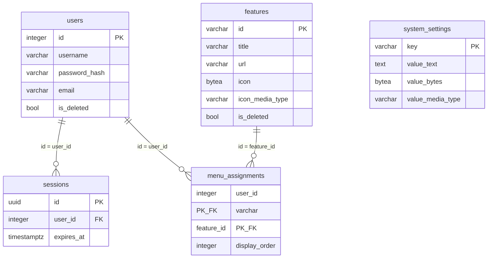

# DB設計: server-start（PC起動）

## 概要

この機能が使うスキーマとテーブルの範囲。`requirements.md` の該当 REQ を満たすことだけを書く。

本機能の固有スキーマは作らない。固有テーブルも作らない。DDL は持たない。ユーザ、セッション、システム設定、機能マスタ、メニュー割当はスキーマ `public` の既存表を読む。複製しない。列は増やさない。表の作成と初期データは `portal` が担う。ping 先、MAC、待ち時間はテーブルに置かず、設定ファイルから読む。ログはファイルへ出す。テーブルには置かない。

関連ドキュメント:

- 全体設計: `design.md`
- UI設計: `ui-design.md`
- API設計: `api-design.md`

## ER図

mermaid の erDiagram は `boolean` を型として書くとパースが壊れる。図の中だけ `bool` と書く。実体の型はテーブル設計どおり `boolean` である。

本機能が作る表は無い。参照する `public` の関係だけを示す。定義の正は `portal` の DB 設計である。

## テーブル設計

列と制約は `public` 表に合わせる。本機能は列を増やさない。

### public.users

目的: ログインに使うユーザ。本機能は読取のみ（追加・更新・論理削除はしない）。

| カラム | 型 | NULL | 既定 | 説明 |
|--------|-----|------|------|------|
| `id` | integer | NOT NULL | シーケンス | ユーザID。PK |
| `username` | varchar(255) | NOT NULL | - | ユーザ名。ログインに使う |
| `password_hash` | varchar(255) | NOT NULL | - | パスワードのハッシュ。本機能は使わない |
| `email` | varchar(255) | NOT NULL | `''` | メールアドレス。本機能は使わない |
| `is_deleted` | boolean | NOT NULL | false | 論理削除なら true |

制約:

- 主キー: `id`
- 一意: `username`（論理削除済みも含め、同じユーザ名は置けない）
- 外部キー: なし

インデックス:

- `username`（一意制約に付随）

本機能の扱い:

- セッションから特定したユーザが `is_deleted = false` のときだけ許可する。
- `password_hash` と `email` は読まない。
- 列は増やさない。

### public.sessions

目的: ログイン状態。本機能は参照のみ（作成・ログアウトはしない）。Cookie のセッション ID でユーザを特定する。

| カラム | 型 | NULL | 既定 | 説明 |
|--------|-----|------|------|------|
| `id` | uuid | NOT NULL | 生成した UUID | セッション ID。PK。Cookie の値 |
| `user_id` | integer | NOT NULL | - | 対象ユーザ。`users.id` |
| `expires_at` | timestamptz | NOT NULL | - | この日時を過ぎたら未ログイン |

制約:

- 主キー: `id`
- 一意: なし
- 外部キー: `user_id` → `public.users.id`（ON DELETE RESTRICT）

インデックス:

- `user_id`
- `expires_at`

本機能の扱い:

- 行が無い、期限切れ、対象ユーザが論理削除済みは未ログイン。
- 利用のたびに `expires_at` を延ばしてよい。期限は `SESSION_TIMEOUT_MINUTES` から算出する。
- セッションの新規作成と破棄はしない。

### public.system_settings

目的: 機能をまたいで参照する値。本機能は読むだけ（変更しない）。ログイン URL、メニュー URL、システム共通アイコン。

| カラム | 型 | NULL | 既定 | 説明 |
|--------|-----|------|------|------|
| `key` | varchar(64) | NOT NULL | - | 設定キー。PK |
| `value_text` | text | NULL | - | URL など文字列の値 |
| `value_bytes` | bytea | NULL | - | アイコンのバイナリ。ディスク上のファイルは持たない |
| `value_media_type` | varchar(64) | NULL | - | バイナリのメディアタイプ。文字列の設定では NULL |

制約:

- 主キー: `key`
- 一意: なし
- 外部キー: なし
- 検査: `value_text` と `value_bytes` のうち、ちょうど一方だけが NOT NULL
- 検査: `value_bytes` があるとき `value_media_type` は NOT NULL。`value_text` があるとき `value_media_type` は NULL

インデックス:

- なし（PK のみ）

本機能が読むキー:

| key | 使う列 | 用途 |
|-----|--------|------|
| `login_url` | `value_text` | 未ログイン時の誘導先 |
| `menu_url` | `value_text` | 戻る先 |
| `icon_system` | `value_bytes` + `value_media_type` | ヘッダのシステムアイコン |
| `icon_back` | `value_bytes` + `value_media_type` | ヘッダの戻るアイコン |

`icon_settings` は本機能の画面では使わない。DB には Base64 や data URL としては置かない。

### public.features

目的: 機能マスタ。本機能は利用可否判定のために読むだけ（追加・更新・論理削除はしない）。

| カラム | 型 | NULL | 既定 | 説明 |
|--------|-----|------|------|------|
| `id` | varchar(64) | NOT NULL | - | 機能ID。運用者が指定する。PK |
| `title` | varchar(255) | NOT NULL | - | メニューに出すタイトル |
| `url` | varchar(2048) | NOT NULL | - | 遷移先 URL |
| `icon` | bytea | NOT NULL | - | 機能を表すアイコンのバイナリ |
| `icon_media_type` | varchar(64) | NOT NULL | - | アイコンのメディアタイプ |
| `is_deleted` | boolean | NOT NULL | false | 論理削除なら true |

制約:

- 主キー: `id`
- 一意: なし（PK が識別子）
- 外部キー: なし

インデックス:

- なし（PK のみ）

本機能の扱い:

- 識別子 `server-start` かつ `is_deleted = false` のときだけ、本機能として有効とみなす。
- 列は増やさない。行の追加は運用またはユーザ管理が行う。

### public.menu_assignments

目的: ユーザのメニューに載せる機能と表示順。本機能は利用可否判定のために読むだけ（追加・解除はしない）。

| カラム | 型 | NULL | 既定 | 説明 |
|--------|-----|------|------|------|
| `user_id` | integer | NOT NULL | - | 対象ユーザ。`users.id` |
| `feature_id` | varchar(64) | NOT NULL | - | 対象機能。`features.id` |
| `display_order` | integer | NOT NULL | - | 表示順。値が小さいほど先 |

制約:

- 主キー: `(user_id, feature_id)`
- 一意: なし（同じユーザで `display_order` が同じになってよい）
- 外部キー: `user_id` → `public.users.id`（ON DELETE RESTRICT）
- 外部キー: `feature_id` → `public.features.id`（ON DELETE RESTRICT）

インデックス:

- `(user_id, display_order)`

本機能の扱い:

- ログイン中ユーザと `feature_id = 'server-start'` の行があり、ユーザと機能が未削除のときだけ許可する。
- 行の追加・削除はしない。

## 関連

- `users` 1 対 多 `sessions`。本機能はセッションを作らず、破棄しない。
- `users` 1 対 多 `menu_assignments`。本機能は割当を変えない。
- `features` 1 対 多 `menu_assignments`。本機能は機能マスタを変えない。
- `system_settings` は他表と結び付けない。本機能は参照のみ。
- 本機能が物理削除する行は無い。

## 要件トレーサビリティ

| 要件 | 設計 |
|------|------|
| REQ-001 | `public.sessions`、`public.users`、`public.features`（`id = 'server-start'`）、`public.menu_assignments` |
| REQ-002 | テーブルなし（ping 先は設定。状態は保持しない） |
| REQ-003 | テーブルなし（起動処理は本機能配下のスクリプト） |
| REQ-004 | テーブルなし（続行確認は画面） |
| REQ-005 | テーブルなし（起動処理の終了コード） |
| REQ-006 | テーブルなし（実行中はプロセス内の状態） |
| REQ-007 | テーブルなし（ファイルログ） |

## 未決事項

- なし

## 承認

現在の状態: 承認済み

| 日時 | 状態 | 変更概要 |
|------|------|----------|
| 2026-09-10 20:59 | 未承認 | 初版 |
| 2026-09-10 21:06 | 承認済み | 初版を承認 |
