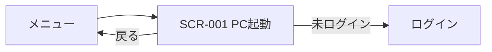

# UI設計: server-start（PC起動）

## 概要

この機能の画面構成と、画面毎の部品配置。`requirements.md` の該当 REQ を満たすことだけを書く。

起動・モジュール構成は `design.md`、API の契約は `api-design.md`、テーブル定義は `db-design.md` に書く。

色・余白・部品の見た目、画面分割とナビは `.cursor/rules/15-ui-style.mdc` に従う。コンテンツ領域に置く部品は、この機能の要件に合わせて決める。他機能の画面は参照しない。`--color-primary` は Orange `#FF9A4A`。

関連ドキュメント:

- 全体設計: `design.md`
- DB設計: `db-design.md`
- API設計: `api-design.md`

## 共通UI

ヘッダとナビの形は `15-ui-style.mdc`。ログイン画面とメニュー画面は持たない。殻を使う。

| 部品 | 配置箇所 | 役割 |
|------|----------|------|
| 戻る | ヘッダ | テキストボタン。戻るアイコンと「戻る」。メニュー画面 URL へ進む。 |
| 見出し | ヘッダ | 「PC起動」。 |
| システムアイコン | ヘッダ | システム全体を表すアイコン。押しても遷移しない。 |
| ナビ「PC起動」 | ナビ | SCR-001 へ。現在地を示す。項目はこの 1 つのみ。 |
| 確認ダイアログ | モーダル | 起動済みのときに起動を指示したときの警告。「起動」と「キャンセル」。 |

未ログインで画面を開いたときは、内容を見せずログイン画面 URL へ進む。本機能が割り当てられていないときは、内容を見せず、コンテンツに「この機能を使えません」と戻る操作だけを示す。

## 画面一覧

| 画面ID | 画面名 | パス | 目的 | 対応 REQ |
|--------|--------|------|------|----------|
| SCR-001 | PC起動 | `/portal_server_start/` | 起動対象の起動済み／未起動を示し、起動を指示する。起動済みのときは警告と続行の確認をする。 | REQ-001, REQ-002, REQ-003, REQ-004, REQ-005, REQ-006 |

## 画面詳細

### SCR-001 PC起動

- パス: `/portal_server_start/`
- 目的: 決められた 1 台の起動対象について、起動済みかどうかを示し、起動を指示する。
- 対応 REQ: REQ-001, REQ-002, REQ-003, REQ-004, REQ-005, REQ-006

#### レイアウト

殻（ヘッダ / ナビ / コンテンツ）は `15-ui-style.mdc`。下表はコンテンツ領域の部品。同じ役割の部品は同ルールの呼び方（主ボタン、説明文、など）を使う。

| 領域 | 部品 | 内容・動作 |
|------|------|------------|
| メイン | エラー | 失敗時、領域先頭に一文。内部理由は出さない。 |
| メイン | 成功 | 起動処理が成功したとき、領域先頭に「起動を指示しました」。数秒で消す。実機が起きたことは書かない。 |
| メイン | 説明文 | 起動対象の状態。「起動済み」または「未起動」。 |
| メイン | 副ボタン | 「確認」。状態を再取得する。 |
| メイン | 主ボタン | 「起動」。未起動ならそのまま起動を指示する。起動済みなら確認ダイアログを出す。 |

ページ全体はスクロールしない。確認ダイアログは前面に出す。

#### 部品詳細

| 部品 | 必須 | 初期値 | バリデーション | 備考 |
|------|------|--------|----------------|------|
| 説明文（状態） | - | 取得前は出さない | - | 「起動済み」または「未起動」 |
| 副ボタン「確認」 | - | - | - | 読込中・起動実行中は無効 |
| 主ボタン「起動」 | - | - | - | 読込中・起動実行中は無効。状態未取得では出さない |
| 確認ダイアログ | - | 非表示 | - | 文言は「起動済みです。続けて起動しますか？」。主ボタン「起動」で続行、副ボタン「キャンセル」で閉じる |
| エラー | - | 非表示 | - | 失敗時のみ。詳細理由は出さない |
| 成功 | - | 非表示 | - | 起動処理の成功時のみ |

#### 操作

| 操作 | 部品 | 結果 |
|------|------|------|
| 戻る | ヘッダの「戻る」 | メニュー画面 URL へ進む。 |
| 確認 | 副ボタン「確認」 | 状態を再取得する。成功なら説明文を更新する。失敗ならエラー。 |
| 起動（未起動） | 主ボタン「起動」 | 起動を指示する。成功なら成功メッセージ。失敗ならエラー。実行中は操作を無効にし、「起動を実行中…」を示す。 |
| 起動（起動済み） | 主ボタン「起動」 | 確認ダイアログを出す。起動指示はまだ送らない。 |
| 続行 | ダイアログの「起動」 | ダイアログを閉じ、起動を指示する。以降は未起動時の起動と同じ。 |
| キャンセル | ダイアログの「キャンセル」 | ダイアログを閉じる。起動は指示しない。 |

#### 状態

| 状態 | 表示 |
|------|------|
| 初期 | 状態の取得を開始する。主ボタンは出さない。 |
| 読込中 | 中央に「読み込み中…」。操作は無効。 |
| 起動実行中 | 「起動を実行中…」。操作は無効。 |
| 空 | 無い。起動対象は常に 1 台。状態が取れるまでは読込中。 |
| エラー | 領域先頭にエラーメッセージ。操作は可能なら維持。未ログインは表示せずログイン画面へ進む。割当なしは「この機能を使えません」。 |
| 成功 | 領域先頭に成功メッセージ。数秒で消す。状態の説明文は起動前のまま（成功判定に ping は使わない）。 |

#### レスポンシブ

殻は 15、コンテンツは同一。単一カラム。一覧と詳細の分割は無い。

## 画面遷移

| 起点 | 操作 | 条件 | 行き先 |
|------|------|------|--------|
| メニュー | 本機能を選ぶ | なし | SCR-001 |
| SCR-001 | 戻る | なし | メニュー画面 URL |
| SCR-001 | 画面を開く | 未ログイン | ログイン画面 URL |
| SCR-001 | 確認 | なし | 同一画面（状態を更新） |
| SCR-001 | 起動 | 未起動 | 同一画面（起動を指示） |
| SCR-001 | 起動 | 起動済み | 同一画面（確認ダイアログ） |
| SCR-001 | 続行 | なし | 同一画面（起動を指示） |
| SCR-001 | キャンセル | なし | 同一画面（ダイアログを閉じる） |

## 要件トレーサビリティ

| 要件 | 設計 |
|------|------|
| REQ-001 | 共通UIの未ログイン誘導と割当なし表示。SCR-001 |
| REQ-002 | SCR-001 の説明文と副ボタン「確認」 |
| REQ-003 | SCR-001 の主ボタン「起動」（未起動） |
| REQ-004 | SCR-001 の確認ダイアログ |
| REQ-005 | SCR-001 の成功／エラー。成功文言は起動指示の完了 |
| REQ-006 | SCR-001 の起動実行中。ボタン無効 |
| REQ-007 | 画面では扱わない（ログは `design.md`） |

## 未決事項

- なし

## 承認

現在の状態: 承認済み

| 日時 | 状態 | 変更概要 |
|------|------|----------|
| 2026-09-10 20:47 | 未承認 | 初版 |
| 2026-09-10 20:59 | 承認済み | 初版を承認 |
